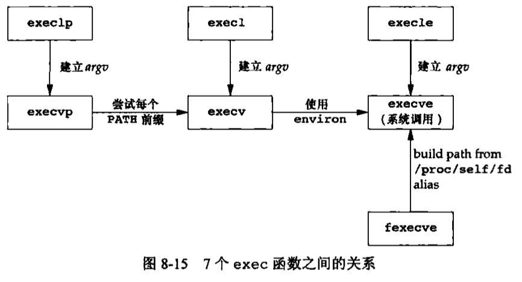

## 进程控制

### 进程标识

每个进程都有一个非负整型表示的唯一进程ID。

```c
#include <unistd.h>
  pid_t getpid(void);
            //返回值：调用进程的进程ID
  pid_t getppid(void);
            //返回值：调用进程的父进程ID
  uid_t getuid(void);
            //返回值：调用进程的实际用户ID
  uid_t geteuid(void);
            //返回值：调用进程的有效用户ID
  gid_t getgid(void);
            //返回值：调用进程的实际组ID
  gid_t getegid(void);
            //返回值：调用进程的有效组ID
```

### 函数 fork

一个现有的进程可以调用 fork 函数创建一个新进程。

```c
#include <unistd.h>
  pid_t fork(void);
            //返回值：子进程返回0，父进程返回子进程ID；若出错，返回-1

/*
  1. 由 fork 创建的新进程被称为子进程。fork 函数被调用一次，但返回两次。两次返回的区别是子进程的返回值是0，而父进程的返回值则是新建子进程的进程ID。
  2. 子进程获得父进程数据空间、堆和栈的副本。这是子进程所拥有的副本。父进程和子进程并不共享这些存储空间部分。
  3. 父进程和子进程共享正文段。
  4. 写时复制技术
    由于在 fork 之后经常跟随着 exec，所以现在的很多实现并不执行一个父进程数据段、栈和堆的完全副本。这些区域由父进程和子进程共享，而且内核将它们的访问权限改变为只读。如果父进程和子进程中的任一个试图修改这些区域，则内核只为修改区域的那块内存制作一个副本。
*/

//eg
#include <stdio.h>
#include <unistd.h>
#include <stdlib.h>

int globvar = 6;
char buf[] = "a write to stdout\n";

int main()
{
    int var;
    pid_t pid;

    var = 88;
    if (write(STDOUT_FILENO, buf, sizeof(buf) - 1) != sizeof(buf) - 1) {
        perror("write error");
        exit(EXIT_FAILURE);
    }
    printf("before fork \n");
    if ((pid = fork() < 0)) {
        perror("fork error");
        exit(EXIT_FAILURE);
    } else if (pid == 0) {
        globvar++;
        var++;
    } else {
        sleep(2);
    }
    printf("pid = %ld,glob = %d, var = %d\n", (long)getpid(), globvar, var);
    exit(EXIT_SUCCESS);
}
/*
  strlen 计算不包含终止 null 字节的字符串长度，而 sizeof 则计算包括终止 null 字节的缓冲区长度。
  两者之间另一个差别是，使用 strlen 需进行一次函数调用，而对于 sizeof 而言，因为缓冲区已用已知字符串进行初始化，其长度是固定的，所以 sizeof 是在编译时计算缓冲区长度。
*/
/*
  执行结果
    machunyudeMacBook-Pro:example machunyu$ gcc -o 8_3_fork 8_3_fork.c 
    machunyudeMacBook-Pro:example machunyu$ ./8_3_fork 
    a write to stdout
    before fork 
    pid = 1529,glob = 7, var = 89
    pid = 1530,glob = 7, var = 89
    machunyudeMacBook-Pro:example machunyu$ ./8_3_fork >> file
    machunyudeMacBook-Pro:example machunyu$ cat file
    a write to stdout
    before fork 
    pid = 1534,glob = 7, var = 89
    before fork 
    pid = 1535,glob = 7, var = 89
*/
```

**printf 输出两次** ：在 fork 之前调用 printf 一次，但当调用 fork 时，该行数据仍在缓冲区中，然后在将父进程数据空间复制到子进程中时，改行缓冲区数据也被复制到子进程中，此时父进程和子进程各自有了带该行缓冲内容的缓冲区。当每个进程终止时，其缓冲区中的内容被写到相应文件中。（标准I/O库带缓冲，终端是行缓冲，其他是全缓冲）。

**文件共享** ：重定向父进程的标准输出时，子进程的标准输出也被重定向。实际上，fork 的一个特性是父进程的所有打开文件描述符都被复制到子进程中。父进程和子进程每个相同的打开描述符共享一个文件表项。

在 fork 之后处理文件描述符有以下两种常见的情况。

1. 父进程等待子进程完成。在这种情况下，父进程无需对其描述符做任何处理。当子进程终止后，它曾进行过读、写操作的任一共享描述符的文件偏移量已做了相应更新。
2. 是父进程和子进程各自执行不同的程序段。在这种情况下，在 fork 之后，父进程和子进程各自关闭它们不需使用的文件描述符，这样就不会干扰对方使用的文件描述符。这种方法是网络服务器进程经常使用的。

fork 失败的两个主要原因是：

1. 系统已经有了太多的进程。
2. 该实际用户ID的进程总数超过了系统限制。

### 函数 wait 和 waitpid

调用 wait 或 waitpid 的进程可能发生的情况：

* 如果其所有子进程都还在运行，则阻塞。
* 如果一个子进程已终止，正等待父进程获取其终止状态，则取得该子进程的终止状态立即返回。
* 如果它没有任何子进程，则立即出错返回。

```c
#include <sys/wait.h>
  pid_t wait(int *statloc);
  pid_t waitpid(pid_t pid, int *statloc, int options);
            //两个函数返回值：若成功，返回进程ID；若出错，返回0 或者 -1

/*
  区分
    1. 在一个子进程终止前，wait 使其调用者阻塞，而 waitpid 有一选项，可使调用者不阻塞。
    2. waitpid 并不等待在其调用之后的第一个终止子进程，它有若干个选项，可以控制它所等待的进程。

  statloc
    是一个整型指针。如果 statloc 不是一个空指针，则终止进程的终止状态就存放在它所指向的单元内。如果不关心终止状态，则可将该参数指定为空指针。
  waitpid 函数中的pid参数作用
    pid == -1 等待任一子进程。此种情况下，waitpid 与 wait 等效。
    pid > 0 等待进程 ID 与 pid 相等的子进程。
    pid == 0 等待组 ID 等于调用进程组ID的任一子进程。
    pid < -1 等待组 ID 等于pid的绝对值的任一子进程。
  
*/

//eg
#include <stdlib.h>
#include <stdio.h>
#include <sys/wait.h>
#include <unistd.h>

void pr_exit(int status)
{
    if (WIFEXITED(status)) {
        printf("normal termination, exit status = %d\n",WEXITSTATUS(status));
    } else if (WIFSIGNALED(status)) {
        printf("abnormal termination, signal number = %d%s\n",WTERMSIG(status),
        #ifdef WCOREDUMP
          WCOREDUMP(status) ? "(core file generated)" : "");
        #else
        "");
        #endif
    } else if (WIFSTOPPED(status)){
        printf("child stopped, signal number = %d\n",WSTOPSIG(status));
    }
}

int main()
{
    pid_t pid;
    int status;
    //正常终止
    if ((pid = fork()) < 0) {
        printf("fork error");
        exit(EXIT_FAILURE);
    } else if (pid == 0) {
        exit(7);
    }
    if (wait(&status) != pid) {
        printf("wait error");
        exit(EXIT_FAILURE);
    }
    pr_exit(status);
    //abort
    if ((pid = fork()) < 0) {
        printf("fork error");
        exit(EXIT_FAILURE);
    } else if (pid == 0) {
        abort();
    }
    if (wait(&status) != pid) {
        printf("wait error");
        exit(EXIT_FAILURE);
    }
    pr_exit(status);
    exit(0);
}
```

### waitid

```c
#include <sys/wait.h>
  int waitid(idtype_t idtype, id_t id, siginfo_t *infop, int options);
            //返回值：若成功，返回0；若出错，返回-1
  /*
    waitid 允许一个进程指定要等待的子进程，但它使用两个单独的参数表示要等待的子进程所属的类型，而不是将此与进程ID或进程组ID组合一个参数。id 参数的作用与 idtype 的值相关。
    idtype
      P_PID 等待一待定进程；id 包含要等待子进程的进程ID
      P_PGID 等待一特定进程组的任一子进程；id 包含要等待子进程的进程组ID。
      P_ALL 等待任一子进程；忽略ID。
    options
      WCONTINUED 等待一进程，它以前曾被停止，此后又已继续，但其状态尚未报告
      WEXITED 等待已退出的进程
      WNOHANG 如无可用的子进程退出状态，立即返回而非阻塞
      WNOWAIT 不破坏子进程退出状态，该子进程退出状态可由后续的 wait、waitid 和 waitpid 调用取得。
      WSTOPPED 等待一进程，它已经停止，但其状态尚未报告。
  */
```

### 函数 exec

```c
#include <unistd.h>
  int execl(const char *pathname, const char *arg0, .../* (char *)0 */ );
  int execv(const char *pathname, char *const argv[]);
	int execle(const char *pathname, const char *arg0, .../* (char *)0, char *const envp[]*/);
  int execve(const char *pathname, char *const argv[], char *const envp[]);
  int execlp(const char *filename, const char *arg0, .../* (char *)0 */);
  int execvp(const char *filename, char *const argv[]);
  int fexecve(int fd, char *const argv[], char *const envp[]);
            //7个函数返回值；若出错，返回-1，若成功，不返回。

/*
  1. (char *)0 说明了最后一个命令行参数之后跟了一个空指针。如果用常量0来表示一个空指针，则必须将它强制转换为一个指针：否则它将被解释为整型参数。
  2. 函数 execl、execlp 和 execle 要求将新程序的每个命令行参数都说明为一个单独的参数。这种参数表以空指针结尾。
  3. 以 e 结尾的3个函数可以传递一个指向环境字符串指针数组的指针。其他4个函数则使用调用进程中的 environ 变量为新程序复制现有的环境。
  4. 在 exec 前后实际用户ID和实际组ID保持不变，而有效ID是否改变则取决于所执行程序文件的设置用户ID位和设置组ID位是否设置。如果新程序的设置用户ID位已设置，则有效用户ID变成程序文件所有者的ID；否则有效用户ID不变。对组ID的处理方式与此相同。
*/

//eg
  //execl
      execl("/bin/ls","ls","-al","/etc/passwd",(char *)0);
  //execv
      char *argv[] = {"ls","-al","/etc/passwd",(char *)0};
      execv("/bin/ls", argv);
  //execve
      char *argv[] = {"ls","-al","/etc/passwd",(char *)0};
      char *envp[] = {"PATH=/bin",(char *)0};
      execve("~/code/test", argv, envp);
  //execlp
      //执行ls -al /etc/passwd，execlp()会依PATH 变量中的/bin 找到/bin/ls
      execlp("ls","ls","-al","/etc/passwd",(char*)0);
  //execvp
      //execvp()会从PATH 环境变量所指的目录中查找符合参数file 的文件名, 找到后便执行该文件, 然后将第二个参数argv 传给该欲执行的文件。
      char *argv[] = {"ls","-al","/etc/passwd",(char *)0};
      execvp("ls",argv);
```



### 更改用户ID和更改组ID

设置实际用户ID和有效用户ID。

```c
#include <unistd.h>
  int setuid(uid_t uid);
  int setgid(gid_t gid);
            //两个函数返回值：若成功，返回0；若出错，返回-1
  /*
    1. 若进程具有超级用户特权，则 setuid 函数将实际用户ID、有效用户ID以及保存的设置用户ID设置为 uid。
    2. 若进程没有超级用户特权，但是 uid 等于实际用户ID或保存的设置用户ID，则 setuid 只将有效用户ID设置为uid。不更改实际用户ID和保存的设置用户ID。
    3. 如果上面两个条件都不满足，则 errno 设置为 EPERM，并返回 -1
  */

#include <unistd.h>
  int setreuid(uid_t ruid, uid_t euid);
  int setregid(gid_t rgid, gid_t egid);
            //两个函数返回值：若成功，返回0；若出错，返回-1
  /*
   1. 交换实际用户ID和有效用户ID的值
   2. 一个非特权用户总能交换实际用户ID和有效用户ID。这就允许一个设置用户ID程序交换成用户的普通权限，以后又可再次交换回设置用户ID权限。
  */

#include <unistd.h>
  int seteuid(uid_t uid);
  int setegid(gid_t gid);
            //两个函数返回值：若成功，返回0；若出错，返回-1
  /*
    1. 只更改有效用户ID和有效组ID
    2. 一个非特权用户可将其有效用户ID设置为其实际用户ID或其保存的设置用户ID。
    3. 对于一个特权用户则可将有效用户ID设置为 uid。
  */
```

内核所维护的3个用户ID：

1. 只有超级用户进程可以更改实际用户ID。通常，实际用户ID是在用户登录时，由 login 程序设置的，而且决不会改变它，因为 login 是一个超级用户进程，当它调用 setuid 时，设置所有3个用户ID。
2. 仅当对程序文件设置了设置用户ID位时，`exec`  函数才设置有效用户ID。如果设置用户ID位没有设置，`exec ` 函数不会改变有效用户ID，而将维持其现有值。任何时候都可以调用 `setuid` ，将有效用户ID设置为实际用户ID或保存的设置用户ID。
3. 保存的设置用户ID是由 exec 复制有效用户ID而得到的。如果设置了文件的设置用户ID位，则在 exec 根据文件的用户ID设置了进程的有效用户ID以后，这个副本就被保存起来了。


### 函数 system

```c
#include <stdlib.h>
  int system(const char *cmdstring);
  /*
    因为 system 在实现中调用了 fork、exec 和 waitpid，因此有3种返回值。
     1. fork 失败或者 waitpid 返回除 EINTR 之外的错误，则 system 返回-1，并且设置 errno 以指示错误类型。
     2. 如果 exec 失败（表示不能执行shell），则其返回值如果shell 执行了 exit(127) 一样。
     3. 否则所有3个函数（fork、exec和waitpid）都成功，那么system的返回值是 shell 的终止状态。
  */
```

### 用户标识

用 `getlogin` 函数可以获取登录名。

```c
#include <unistd.h>
  char *getlogin(void);
            //返回值：若成功，返回指向登录名字符串的指针；若出错，返回 NULL。
/*
  给出了登录名，就可用 getpwnam 在口令文件中查找用户的相应记录，从而确定其登录 shell。
*/
```

