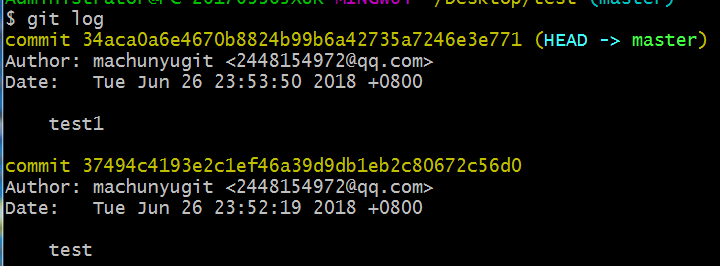

# 觉今是而昨非

## `.gitignore` 的格式规范

1. 所有空行或者以 `＃` 开头的行都会被 Git 忽略。
2. 匹配模式可以以（`/`）开头防止递归。
3. 匹配模式可以以（`/`）结尾指定目录。
4. 要忽略指定模式以外的文件或目录，可以在模式前加上惊叹号（`!`）取反。

## 基础命令

1. 查看当前状态

   ```shell
   git status
   ```

2. 跟踪新文件

   ```shell
   git add file
   git add ./*
   ```

3. 查看已暂存和未暂存的修改

   ```shell
   git diff file 		未暂存的修改
   git diff --cached 	已经暂存的修改
   ```

4. 提交更新

   ```shell
   git commit -m 'describe'
   git commit -a -m 'describe' 跳过使用暂存区域
   ```

5. 移除文件

   * `git rm filename` 从已跟踪文件清单中移除，并把工作目录中的文件也删除。
   * 如果删除之前修改过并且已经放到暂存区域的话，则必须要用强制删除选项 `-f`（译注：即 force 的首字母）。 这是一种安全特性，用于防止误删还没有添加到快照的数据，这样的数据不能被 Git 恢复。
   * `git rm --cached` 从暂存区域移除。

## 分支

1. 创建分支

   ```shell
   git branch testing
   ```

2. 切换分支

   ```shell
   git checkout testing
   ```

3. `git checkout -b branchname` 这个命令相当于运行了

   ```shell
   git branch testing   # 创建
   git checkout testing # 切入
   ```

4. `git branch -d branchname`  删除某个无用的分支

5. 合并某个分支

   ```shell
   git checkout master
   git merge branchname
   ```

6. 列出分支的清单

   ```shell
   git branch
   ```

7. 查看各个分支最后一个提交对象的信息

   ```shell
   git branch -v
   ```

   

8. 从该清单中筛选出你已经( 或者尚未) 与当期分支合并的分支

   ```shell
   git branch --merged  #查看哪些分支已经被并入当前分支
   git branch --no-merged #查看哪些分支尚未和当前分支合并
   ```

9. 推送本地分支

   ```shell
   # git push (远程仓库名) (分支名)
   git push origin sereverfix  #推送本地到远程
   git fetch origin
   ```

10. 利用分支进行开发的工作流程

    - 长期分支: 同时拥有多个开放的分支, 每个分支用于完成特定的任务, 随着开发的推进, 你可以随时把某个特性分支的成果并到其他分支中。**master分支中保留完全稳定的代码, develop 或者 next 平行分支, 专门用于后续的开发。**

    - 特性分支: 一个特性分支是指一个短期的, 用来实现单一特性或与其相关工作的分支, 在提交了若干更新后, 把它们合并到主干分支, 然后删除.  ( 前提是分支的代码已经比较成熟了)。
    - 远程分支 : 是对远程仓库中的分支的索引, 它们是一些无法移动的本地分支; 只有在Git进行网络交互是才会更新. 远程分支就像书签, 提醒着你上次连接远程仓库是上面个分支的位置。


## 版本回退

1. 使用 `git log` 查看实际工作中历史记录

   

2. Git必须知道当前版本是哪个版本，在Git中，用`HEAD`表示当前版本，也就是最新的提交34aca0...`（注意我的提交ID和你的肯定不一样），上一个版本就是`HEAD^`，上上一个版本就是`HEAD^^`，当然往上100个版本写100个`^`比较容易数不过来，所以写成`HEAD~100`。 

   ```html
   #回退上一个版本
   git reset --hard HEAD^
   git reset --hard HEAD～1
   #回退到指定版本
   git reset --hard 34aca0a6e4670b882
   ```

3. Git提供了一个命令`git reflog`用来记录你的每一次命令： 

   

4. 撤销修改

   - 命令`git checkout -- readme.txt`意思就是，把`readme.txt`文件在工作区的修改全部撤销，这里有两种情况：
   - 一种是`readme.txt`自修改后还没有被放到暂存区，现在，撤销修改就回到和版本库一模一样的状态；
   - 一种是`readme.txt`已经添加到暂存区后，又作了修改，现在，撤销修改就回到添加到暂存区后的状态。
   - 总之，就是让这个文件回到最近一次`git commit`或`git add`时的状态。
   - `git checkout -- file`命令中的`--`很重要，没有`--`，就变成了“切换到另一个分支”的命令，我们在后面的分支管理中会再次遇到`git checkout`命令。 