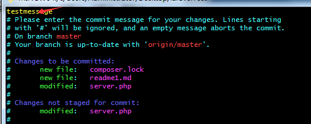

#### Git基础概念

1. 对于任何一个文件, Git内部的三种状态: 已提交( committed ), 已修改( modified ) 和 已暂存( staged);

   * __已提交__ , 表示该文件已经被安全地保存在本地数据库中
   * __已修改__ 表示修改了某个文件, 但是还没有提交保存
   * __已暂存__ 表示把已经修改的文件放在下次提交时要保存的清单中

2. 文件流转的三个工作区域: git的工作目录, 暂存区域, 以及本地仓库

   

   ​

3. 查看配置信息

   ```html
   git config --list
   ```

4. `git init`  通过`git init`命令把当前目录变成Git可以管理的仓库

5. 从现有仓库克隆 `git clone`

   - git 获取的是项目历史的所有数据( 每一个文件的每一个版本 ), 服务器上有的数据克隆之后本地也都有了.  实际上, 即使服务器的磁盘发生故障, 用任何一个克隆出来的客户端都可以重建服务器上的仓库, 回到当初克隆时的状态 

     ```shell
     git clone https://github.com/laravel/laravel.git  #克隆不创建新目录 使用原来的目录
     git clone https://github.com/laravel/laravel.git laravelTest #克隆并创建新目录
     ```

6. `git status`  检查当前文件状态

   ```shell
   $ git status
   On branch master
   Your branch is up-to-date with 'origin/master'.
   nothing to commit, working tree clean
   #所有已跟踪文件在上次提交后都未被更改过；当前目录下没有出现任何未跟踪的新文件。

   $ git status
   On branch master
   Your branch is up-to-date with 'origin/master'.
   Untracked files:
     (use "git add <file>..." to include in what will be committed)

           composer.lock
           readme1.md

   nothing added to commit but untracked files present (use "git add" to track)
   #Untracked files 未跟踪的文件意味着GIt在之前的快照(提交)中没有这些文件;
   ```

7. `git add` 

   * 跟踪新文件

     ```html
     #使用git add 开始跟踪一个新文件, 执行完以后会看到文件已被跟踪, 并处于暂存状态
     #git add 就是把目标文件快照放入暂存区域, 同时未曾跟踪过的文件标记为需要跟踪.
     $ git add readme1.md
     $ git status
     On branch master
     Your branch is up-to-date with 'origin/master'.
     Changes to be committed:
       (use "git reset HEAD <file>..." to unstage)

             new file:   readme1.md
     ```
     * git add 后面可以指明目录下的文件, 在git add 后面可以指明要跟踪的目录或者文件, 如果是目录就说明要递归跟踪目录下的所有文件

   * 暂存已修改文件

     ```shell
     $git status
     #下面, 说明已跟踪的内容发生了变化, 但还没有放到暂存区。要暂存这次更新需要运行git add
     Changes not staged for commit:
       (use "git add <file>..." to update what will be committed)
       (use "git checkout -- <file>..." to discard changes in working directory)

             modified:   server.php
     ```

   * 其他作用， 在合并时把有冲突的文件标记为已解决状态

8. 忽略某些文件 , 将需要忽略的文件加入`.gitignore` 

   ```html
   $ cat .gitignore
   /vendor
   Homestead.json
   Homestead.yaml
   npm-debug.log
   yarn-error.log
   .env
   ```

   * 文件`.gitignore`的格式规范

     * 所有空行或者以注释符号#开头的行都会被Git忽略。
     * 匹配模式最后跟反斜`/`说明要忽略的是目录
     * 要忽略指定模式以为的文件或者目录, 可以在模式前加上叹号`!` 取反

   * 实例

     ```shell
     #忽略所有 .a 结尾的文件
     *.a
     #但是lib.a除外
     !lib.a
     #忽略vendor目录
     /vendor
     ```

9. `git diff`查看已暂存和未暂存的更新

   * 直接`git add `, 此命令比较的是工作目录中当前文件和暂存区域快照之间的差异, 也就是修改之后还没有暂存起来的变化内容. __单单`git diff`  命令只是显示还没有暂存起来的改动__ 

     ```shell
     $ git diff
     diff --git a/server.php b/server.php
     index e7bb1dd9..c0bfe5f6 100644
     --- a/server.php
     +++ b/server.php
     @@ -20,3 +20,4 @@ if ($uri !== '/' && file_exists(__DIR__.'/public'.$uri)) {

      require_once __DIR__.'/public/index.php';
      'dddd';
     +'dddd';
     ```

   * `git diff --cached` 查看已经暂存起来的文件和上次提交时的快照之间的差异(  `git diff --staged` 高版本也可以使用这个命令, 效果是一样的 )

10. git commit

    * 直接执行 `git commit`

      

      __标注的地方用来写说明__

    * git commit -m '2018-5-1 update' 可以使用 -m 参数后跟提交说明

    ​

    ​