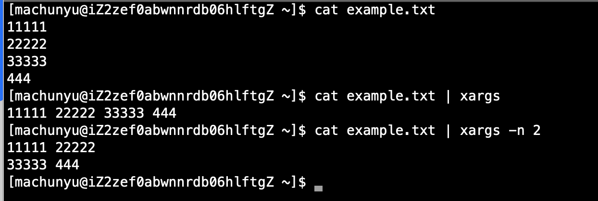

# 第二章

## cat 命令

```shell
cat -s file.txt                     #压缩连续的空白行输出
cat -s file.txt | tr -s '\n'        #压缩并移除空白行  说明:tr -s '\n' 将连续多个'\n'字符压缩成单个'\n'
cat -t table.log                    #查看制表符 说明：这个命令可以将连续的空格区和制表符区分开
```

## 录制与回放终端会话文件和数据

1. Script 命令可以用于简历可在多个用户之间进行广播的视频会话

   ```shell
   # 1. 在 Terminal1 中输入以下命令
   mkfifo scriptfifo
   # 2. 在 Terminal2 中输入
   cat scriptfifo
   # 3. 返回 Terminal1，输入
   script -f scriptfifo
   # 到这里在 Terminal1 输入的命令就会在 Terminal2 的终端实时播放；需要退出 exit
   ```

2. 录制终端会话

   ```shell
   # 开始录制
       script -t 2>time.log -a action.log
       .... # 命令
       ..	 # 命令
       exit;# 结束
   # 说明：time.log 文件用于记录何时运行；action.log 用于存储命令输出。-t 选项用于将时序数据导入stderr。 2> 则用于将 stderr 重定向到 time.log
   # 回放命令执行过程
   scriptreplay time.log action.log
   ```

## 文件查找与文件列表扩展名切分文件名

1. 基本命令

   ```shell
   find base_path                       #要列出当前目录及子目录下所有的文件和文件夹
   find studyC/ -print                  #打印文件和目录的列表
   find ./ -name "*.php" -print         #查找当前目录下所有以php结尾的文件，并打印出文件
   find ./ -iname "t*.php" -print       #查找当前目录下所有以 t （不区分大小写）和 .php 结尾的文件
   find . \( -name "*.pdf" -o -name "*.txt" \) -print   #匹配多个条件中的一个，采用OR条件操作
   find ../ iregex ".*\( \.php\|\.sh)"  #查看 .php 或者 .sh 文件
   find . ! -name "*.txt" -print        #否定参数，查看除了txt文件的其他文件
   find -maxdepth 1 -type f -print      #指定find的向下查找的深度。查找普通文件
   ```

2. 根据类型查找

   ```shell
   find . -type f #普通文件
   find . -type d #目录
   find . -type p #管道文件
   find . -type l #链接文件
   find . -type s #socket文件
   ```

3. 根据文件时间进行搜素

   ```shell
   # -atime 访问时间 -mtime 修改时间 -ctime 文件元数据（例如权限或者所有权）最后一次改变的时间。时间单位：天
   find . -type f -atime 7 -print  #打印出恰好在七天前被访问过的所有文件
   find . -type f -atime +7 -print #打印出访问时间超过七天的所有文件
   find . -type f -atime -7 -print #打印出访问时间小于七天的所有文件
   # -amin 访问时间 -mmin 修改时间 -ctime 变化时间 时间单位：分
   find . -type f -amin -7 -print  #打印出访问时间小于7分钟的文件
   # -newer 参数
   find . -type f -newer file.txt -print #找出比file.txt 修改时间更长的所有文件
   ```

4. 基于文件大小的搜索

   ```shell
   find -type f -size +2k		#查找大于2k的文件
   ```

5. 删除匹配的文件

   ```shell
   find . -type f -name "*.swp" -delete	#查找并删除
   ```

6. 基于文件权限和所有权的匹配

   ```shell
   find . -type f -perm 600 -print						#打印出权限为644的文件
   find . -type f -name "*.php" ! -perm 644 -print		#查找合适的执行权限
   ```

7. 根据用户查找文件

   ```shell
   find ../home/ -type f -user slynux -print			#打印出用户slynux拥有的所有文件
   ```

8. 结合 find 执行命令或者动作

   ```shell
   find . -maxdepth 1 -perm 644 -name "test.log" -exec chown slynux:slynux {} \; #查找并修改权限 root用户
   ```

9. 查找并跳过特定的目录

   ```shell
   find . \( -name ".git" -prune \) -o \( -type of -print \) #打印出不含 .git 的文件路径
   ```

## xargs 将命令输出作为命令参数

1. 

2. 用自己的定界符来分隔参数

   ```shell
   echo "splitXsplitXsplit" | xargs -d X	#使用X为定界符
   cat example.txt | xargs -i touch {}		#创建文件
   cat example.txt | xargs -i rm {}		#删除匹配的文件
   ```

## 用 tr 进行转换检查与词典操作

## 校验和与合适输入自动化

## 排序、单一与重复
