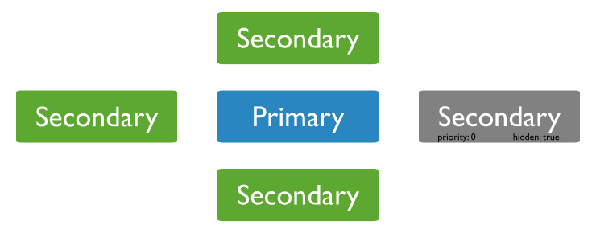
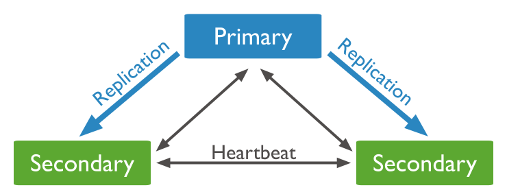
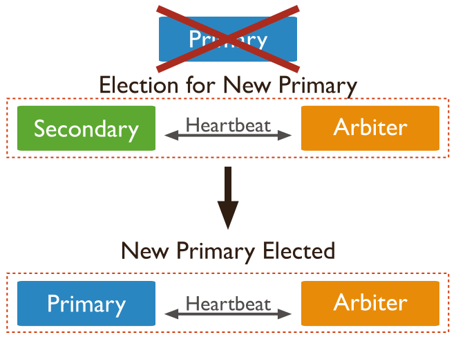

# 副本集

## 副本集的成员

1. MongoDB中的副本集是一组提供冗余和高可用性的 mongod 进程。
2. 副本集最多可包含50个成员，但只有7个投票成员。
3. 副本集成员：
   * `Primary`  ：主要接收所有写操作。
   * `Secondaries` ：辅助节点从主节点复制操作以维护相同的数据集。

## Primary

1. 主服务器是副本集中唯一接收写入操作的成员。
2. MongoDB在主服务器上应用写操作，然后在主服务器的 oplog 上记录操作。
3. 辅助成员复制此日志并将操作应用于其数据集。

4. 副本集的所有成员都可以接受读取操作。但是，默认情况下，应用程序将其读取操作定向到主成员。有关更改默认读取行为的详细信息，请参阅读取[首选项](https://docs.mongodb.com/manual/core/read-preference/)。
5. 副本集最多可以包含一个主副本。如果当前主节点不可用，则选举确定新主节点。

## Arbiter

1. 仲裁者没有数据集的副本，也不能成为主数据集。
2. 副本集可能有仲裁者在主要选举中添加投票。

## Priority 0 Replica Set Members

1. 优先级为0的成员是不能成为主要成员且不能触发选举的成员。
2. 优先级为0的辅助设备作为普通辅助设备运行：它们维护数据集的副本，接受读取操作，并在选举中投票。
3. 将辅助节点配置为优先级为0以防止它成为主节点。

## Hidden Replica Set Members

1. 隐藏成员维护主数据集的副本，但对客户端应用程序不可见。
2. `db.isMaster()` 方法不显示隐藏的成员。
3. 客户端不会将具有适当读取首选项的读取分发给隐藏成员。因此，除基本复制外，这些成员不会收到任何流量。使用隐藏成员执行报告和备份等专用任务。
4. 隐藏的成员可以在副本集选举中投票。

## Delayed Replica Set Members

1. 延迟成员包含副本集数据集的副本。但是，延迟成员的数据集反映了该集合的早期或延迟状态。例如，如果当前时间是09:52并且成员有一小时的延迟，则延迟成员没有比08:52更新的操作。
2. 由于延迟成员是数据集的“滚动备份”或运行“历史”快照，因此它们可以帮助您从各种人为错误中恢复。

### 注意事项

1. 延迟成员：必须是优先级为0的成员。将优先级设置为0以防止延迟成员成为主要成员。
2. 应该是隐藏的成员。始终阻止应用程序查看和查询延迟成员。
3. 如果[`members[n].votes`](https://docs.mongodb.com/manual/reference/replica-configuration/#rsconf.members[n].votes) 设置为1，则在`Primary` 选举中投票。

### 选择延迟量：

1. 必须等于或大于预期的维护窗口持续时间。
2. 必须小于oplog的容量。

## Replica Set Arbiter

1. 仲裁者没有数据集的副本，也不能成为主数据集。
2. 副本集可能有仲裁者在主要选举中添加投票。
3. 仲裁者总是只有1次选举投票。
4. 由于仲裁器不存储数据，因此它们不具有用于身份验证的用户和角色映射的内部表。因此，使用授权登录仲裁服务器的唯一方法是使用 [localhost exception](https://docs.mongodb.com/manual/core/security-users/#localhost-exception)。

## 三个成员副本集

副本集的最小体系结构有三个成员。三个成员副本集可以包含三个保存数据的成员，也可以包含两个保存数据和仲裁的成员。

### 一个主（Primary）两个（secondary）

1. 两个辅助成员都可以成为选举中的候选人。

2. 除主数据库外，这些部署始终提供两个完整的数据集副本。这些副本集提供额外的容错能力和高可用性。如果主服务器不可用，则副本集将选择辅助服务器作为主服务器并继续正常操作。旧主节点在可用时重新加入集合。

3. 故障切换
   

### 一个主（Primary）一个（secondary）一个（Arbiter）

1. `secondary`可以成为选举的主要成员。

2. 一个仲裁者。仲裁者只在选举中投票。

3. 由于仲裁器不保存数据副本，因此这样的部署仅提供一个完整的数据副本。仲裁者的服务器可以配置低，代价是有限的冗余和容错。

4. 故障切换

   

## 副本集分布在两个或更多数据中心

1. 虽然副本集提供针对单实例故障的基本保护，但其成员全部位于单个数据中心的副本集容易受到数据中心故障的影响。停电，网络中断和自然灾害都是可能影响其成员位于单个设施中的副本集的问题。
2. 在不同地理位置的数据中心之间分发副本集成员会增加冗余，并在其中一个数据中心不可用时提供容错功能。

#### 三成员副本集，推荐成员分布

1. 两个数据中心：数据中心1的两个成员和数据中心2的一个成员。如果副本集的其中一个成员是仲裁者，则将仲裁者分配给具有数据承载成员的数据中心1。如果数据中心1关闭，则副本集将变为只读。如果数据中心2关闭，则副本集仍然可写，因为数据中心1中的成员可以进行选举。
2. 三个数据中心：一个成员到数据中心1，一个成员到数据中心2，一个成员到数据中心3。如果任何数据中心发生故障，副本集仍然可写，因为其余成员可以举行选举。

## 副本集选举 Replica Set Elections

1. 在选举成功完成之前，副本集无法处理写入操作。

2. 如果此时查询配置为在辅助节点上运行，则副本集可以继续提供读取查询。
3. 假设默认副本配置设置，群集选择新主节点之前的中位时间通常不应超过12秒。这包括将主要标记为不可用并呼叫和完成选举所需的时间。可以通过修改`settings.electionTimeoutMillis` 复制配置选项来调整此时间段。
4. 网络延迟等因素可能会延长副本集选举完成所需的时间，从而影响群集在没有主节点的情况下运行的时间。这些因素取决于您的特定群集体系结构。

### 影响选举的因素和条件[官网](<https://docs.mongodb.com/manual/core/replica-set-elections/>)

#### 心跳

副本集成员每两秒发送一次心跳（ping）。如果心跳在10秒内没有返回，则其他成员将该成员标记为不可访问。

#### 成员的优先级

在副本集具有稳定的主要副本之后，选举算法将进行“尽力而为”尝试以使具有最高优先级的次要呼叫选举。成员优先权影响选举的时间和结果;优先级较高的次级选举比优先级较低的次级选项要早一些，并且也更有可能获胜。但是，较低优先级的实例可以在短时间内被选为主要实例，即使可用的优先级较高的实例也是如此。副本集成员继续调用选举，直到可用的最高优先级成员成为主要成员。

优先级值为0的成员不能成为主要成员，也不会寻求选举。

### 投票成员

### 非投票成员

虽然无表决权的成员不在选举中投票，但这些成员持有副本集数据的副本，并且可以接受来自客户端应用程序的读取操作。

## [副本集故障转移期间的回滚](<https://docs.mongodb.com/manual/core/replica-set-rollbacks/>)

