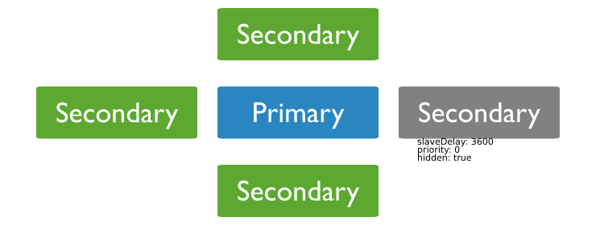

# 复制

## 复制的成员

1. MongoDB中的副本集是一组提供冗余和高可用性的mongod进程。
2. 副本集最多可包含50个成员，但只有7个投票成员。
3. 副本集成员：
   * `Primary`  ：主要接收所有写操作。
   * `Secondaries` ：辅助节点从主节点复制操作以维护相同的数据集。

## Primary

1. 主服务器是副本集中唯一接收写入操作的成员。
2. MongoDB在主服务器上应用写操作，然后在主服务器的oplog上记录操作。
3. 辅助成员复制此日志并将操作应用于其数据集。

4. 副本集的所有成员都可以接受读取操作。但是，默认情况下，应用程序将其读取操作定向到主成员。有关更改默认读取行为的详细信息，请参阅读取首选项。
5. 副本集最多可以包含一个主副本。如果当前主节点不可用，则选举确定新主节点。

## Arbiter

1. 仲裁者没有数据集的副本，也不能成为主数据集。
2. 副本集可能有仲裁者在主要选举中添加投票。

## Priority 0 Replica Set Members

1. 优先级为0的成员是不能成为主要成员且不能触发选举的成员。
2. 优先级为0的辅助设备作为普通辅助设备运行：它们维护数据集的副本，接受读取操作，并在选举中投票。
3. 将辅助节点配置为优先级为0以防止它成为主节点。

## Hidden Replica Set Members

1. 隐藏成员维护主数据集的副本，但对客户端应用程序不可见。
2. `db.isMaster()` 方法不显示隐藏的成员。
3. 客户端不会将具有适当读取首选项的读取分发给隐藏成员。因此，除基本复制外，这些成员不会收到任何流量。使用隐藏成员执行报告和备份等专用任务。
4. 隐藏的成员可以在副本集选举中投票。

## Delayed Replica Set Members

1. 延迟成员包含副本集数据集的副本。但是，延迟成员的数据集反映了该集合的早期或延迟状态。例如，如果当前时间是09:52并且成员有一小时的延迟，则延迟成员没有比08:52更新的操作。
2. 由于延迟成员是数据集的“滚动备份”或运行“历史”快照，因此它们可以帮助您从各种人为错误中恢复。

### 注意事项

1. 延迟成员：必须是优先级为0的成员。将优先级设置为0以防止延迟成员成为主要成员。
2. 应该是隐藏的成员。始终阻止应用程序查看和查询延迟成员。
3. 如果[`members[n].votes`](https://docs.mongodb.com/manual/reference/replica-configuration/#rsconf.members[n].votes) 设置为1，则在`Primary` 选举中投票。

### 选择延迟量：

1. 必须等于或大于预期的维护窗口持续时间。
2. 必须小于oplog的容量。

## Replica Set Arbiter

1. 仲裁者没有数据集的副本，也不能成为主数据集。
2. 副本集可能有仲裁者在主要选举中添加投票。
3. 仲裁者总是只有1次选举投票。
4. 由于仲裁器不存储数据，因此它们不具有用于身份验证的用户和角色映射的内部表。因此，使用授权登录仲裁服务器的唯一方法是使用 [localhost exception](https://docs.mongodb.com/manual/core/security-users/#localhost-exception)。

## Replica Set Oplog

1. oplog（操作日志）是一个特殊的上限集合，它保存了修改存储在数据库中的数据的所有操作的滚动记录。
2. MongoDB在主服务器上应用数据库操作，然后在主服务器的oplog上记录操作。
3. 辅助成员在异步过程中复制并应用这些操作。
4. 所有副本集成员都在local.oplog.rs集合中包含oplog的副本，这允许它们维护数据库的当前状态。
5. 为了便于复制，所有副本集成员都会向所有其他成员发送心跳（ping）。任何辅助成员都可以从任何其他成员导入oplog条目。
6. oplog中的每个操作都是幂等的。也就是说，无论是对目标数据集应用一次还是多次，oplog操作都会产生相同的结果。

### Oplog 的大小

