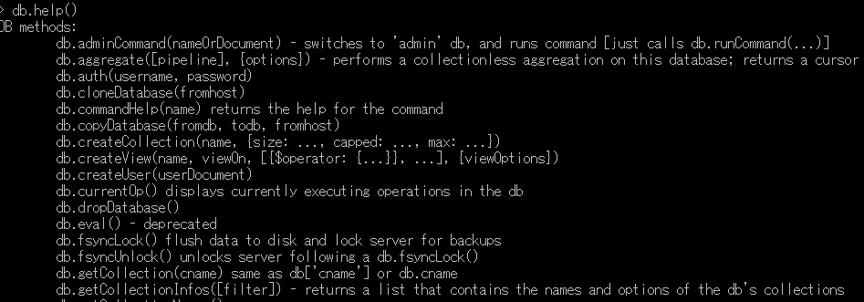

## 积硅步, 致千里

### Mongodb和关系型数据库

|    对比项    |      mongoDB      |     mysql      |
| :----------: | :---------------: | :------------: |
|      表      | 集合(Collection ) |     table      |
| 表的一行数据 |   文档Document    | 一条记录record |
|    表字段    |      键 key       |   字段 field   |
|    字段值    |     值 value      |    值value     |
|    主外键    |        无         |     pk,fk      |
| 灵活度扩展性 |       极高        |       差       |

### 文档 （document）

1. 文档的键不能含 \0 ( 空字符 )，这个字符用于表示键的结尾。

2. MongDB区分大小写和区分类型

   ```mongodb 
   {"Foo":3} 和 {"foo":3}   不是相同的
   {"foo":3} 和 {"foo":"3"} 不是相同的
   ```

3. MongoDB不能有重复的键

   ```mongodb
   {"greeting":"hello world","greeting":"hello MongoDB"} 错误
   ```

4. 文档键命名规范：

   - 键不能含有`\0` (空字符)。这个字符用来表示键的结尾。
   - `.`和`$`有特别的意义，只有在特定环境下才能使用。
   - 以下划线"_"开头的键是保留的(不是严格要求的)。
   - 需要注意的是：
     1. 文档中的键/值对是有序的。
     2. 文档中的值不仅可以是在双引号里面的字符串，还可以是其他几种数据类型（甚至可以是整个嵌入的文档)。
     3. MongoDB区分类型和大小写。
     4. MongoDB的文档不能有重复的键。
     5. 文档的键是字符串。除了少数例外情况，键可以使用任意`UTF-8`字符。

### 集合 （collection）

>组织集合的一种惯例是使用 `.` 分隔不同命名空间的子集合。例如，一个具有博客功能的应用可能包含两个集合，分别是 `blog.posts` 和 `blog.authors` 。这个为了使组织结构更清晰，这里的blog的集合（这个集合甚至不需要存在）跟它的自己和没有任何关系。

### 数据库 （database）

>数据库最终会变成系统里的文件，而数据库名就是相应的文件名

1. admin

   >这个数据库就是 “ root ” 数据库。如果将一个用户添加到admin数据库，这个用户将自动获取所有数据库的权限。一些特定的服务器端命令也是只能从admin数据运行，列出所有数据库或者关闭服务器。

2. local

   > 这个数据库永远不可以复制，且一台服务器的所有本地集合都可以存储在这个数据中。可以用来存储限于本地单台服务器的任意集合。

3. config

   >MongoDB用于分片设置时。

4. 数据库名可以是满足以下条件的任意UTF-8字符串。

   - 不能是空字符串（"")。
   - 不得含有' '（空格)、.、$、/、\和\0 (空字符)。
   - 应全部小写。

### MongoDB的启动

>1. mongodb 在没有参数的情况下会使用默认的数据目录 `/data/db` 。如果数据目录不存在或者不可写，服务器会启动失败。因此 MongoDB 启动前，先创建数据目录，以确保对该目录有写权限。
>2. 启动时，服务器会打印版本和系统信息，然后等待连接。默认清空下，MongoDB监听27017端口。
>3. 通过db命令可以查看当前使用的数据库。

#### MongoDB 启动配置说明

```html
mongod --help 查看启动详细参数
mongodb的参数说明：  
--dbpath 数据库路径(数据文件)  
--logpath 日志文件路径  
--master 指定为主机器

--slave 指定为从机器  
--source 指定主机器的IP地址  
--pologSize 指定日志文件大小不超过64M.因为resync是非常操作量大且耗时，最好通过设置一个足够大的oplogSize来避免resync(默认的 oplog大小是空闲磁盘大小的5%)。  
--logappend 日志文件末尾添加  
--port 启用端口号   默认 27017 端口
--fork 在后台运行  
--only 指定只复制哪一个数据库  
--slavedelay 指从复制检测的时间间隔  
--auth 是否需要验证权限登录(用户名和密码)
```

#### 启动MongoDB服务端

```html
windows 环境启动 mongodb 数据库的
mongod.exe --storageEngine mmapv1 --dbpath D:\MongoDBDATA
mongod.exe --dbpath D:\MongoDBDATA
```

- 看到这个说明数据库启动成功

#### 启动Mongodb客户端

- 默认是用test用户启动mongodb客户端 , 使用超级管理员启动  `mongo 127.0.0.1/admin`

### 数据类型

1. String：字符串。存储数据常用的数据类型。在 MongoDB 中，UTF-8 编码的字符串才是合法的。 

2. null 用来表示空值或者不存在的字段

   ```javascript
   {"key":null}
   ```

3. Boolean 有两个值 true 和 false

   ```javascript
   {"key":true}
   ```

4. 正则表达式： 查询时，使用正则表达式作为限定条件，语法也与 Javascript 的正则表达式相同。用于存储正则表达式。

   ```javascript
   {"key":/foobar/i}
   ```

5. 数组

   ```javascript
   {"key":["a","b","c"]
   ```

6. 内嵌文档 ： 文档可嵌套其他文档，被嵌套的文档作为父文档的值

   ```javascript
   {"key":{"foo":"bar"}}
   ```

7. 对象id ： 是文档的唯一标识

   MongoDB中存储的文档必须有一个 `_id` 键。这个键的值可以是任何类型的，默认是个ObjectId对象。在一个集合里面，每个文档都有一个唯一的`_id` 

   ```javascript
   { "_id" : ObjectId("5b378afa8f979b000c259dba")}
   ```

8. 二进制数据（Binary Data）

   二进制数据是一个任意字节的字符串。它不能直接在shell中使用。如果要将非UTF-8字符保存到数据库中，二进制数据是唯一的方式。

9. Code：代码类型。用于在文档中存储 JavaScript 代码。

### ObjectId详情

>1. ObjectId 不是其他比较常规的做法（比如自增加的主键），因为在多个服务器上同步自动增加主键值即费力又费时。MongoDB设计的初衷就是用作分布式数据库，所以能够在分片的环境中生成唯一的标识符非常重要。
>2. ObjectId使用12字节的存储空间，是一个由24个十六进制数字组成的哦字符串（每个字节可以存储两个十六进制数字）。
>3. 0|1|2|3|4|5|6|7|8|9|10|11|  （5b378afa8f979b000c259dba）
>   * ObjectId 的前4个字节是从标准纪元开始的时间戳，单位秒。时间戳和随后的5个字节组合起来，提供了秒级别的唯一性。
>   * 接下来的 3 个字节是所在主机的唯一标识符。通常是机器主机的散列值（hash）。这样就可以确保不同主机生成不同的 ObjectId 。
>   * 接下来的2个字节来自产生 ObjectId 的进程的进程标识符（PID）。
>   * 最后是一个自动增加的计数器。确保相同进程同一秒产生的ObjectId 是唯一的。一秒钟最多允许每个进程拥有__256的3次方__ 个不同的 ObjectId。
>4. 自动生成 `_id` , 如果插入文档时没有 `_id` 键，系统会自动帮你创建一个。

### 使用MongoDB Shell

1. 连接数据库

   * mongo some-host:prot/myDB

     ```javascript
     mongo 127.0.0.1/admin
     ```

   * 启动 mongo shell 时不连接到任何 mongodb 的方式连接到数据库

     ```javascript
     mongo --nodb  //此时没有连接任何数据库
     conn = new Mongo("127.0.0.1:27017"); 
     db = conn.getDB("admin"); //执行完这条命令就可以正常操作shell
     ```

2. 使用 shell 执行脚本

   1. 在本地执行 js 脚本

      ```javascript
      //mongo shell 会依次执行传入的脚本
      mongo D:/MongoDB3.6/1.js D:/MongoDB3.6/2.js
      ```

   2. 在远程执行 js 脚本

      ```javascript
      //前提是能连接上
      mongo --quiet server-1:30000/foo scrip t1.js
      ```

   3. 可以在脚本中使用 print() 函数将内容输出。

   4. 可以使用 load() 函数，从交互式 shell 中运行脚本。填写路径的时候尽量填写绝对路径，注意 load() 函数无法理解 `~ `这个代表家目录的符号。

      ```javascript
      > load("D:/MongoDB3.6/1.js")
      dddd
      true
      ```

   5. shell 中辅助函数对应的 javascript 函数

      ```html
        shell 中               js 中
      use foo               db.getSisterDB('foo')
      show dbs              db.getMongo().getDBs()
      show collections      db.getCollectonNames()
      ```

### 帮助

1. 数据库级别的几个函数 （db.help()）

   ```javascript
   db.hostInfo();   //get details about the server's host
   db.isMaster();   //check replica primary status
   db.version();    //current version of the server
   db.stats();      //查看当前数据库的信息
   db.logout()
   ```

2. 集合级别的帮助 （ db.collections.help()）

3. 如果想知道一个函数是做什么用的。可以直接查看源码如何是实现的。

   ```javascript
   db.users.update  
   ```

   

