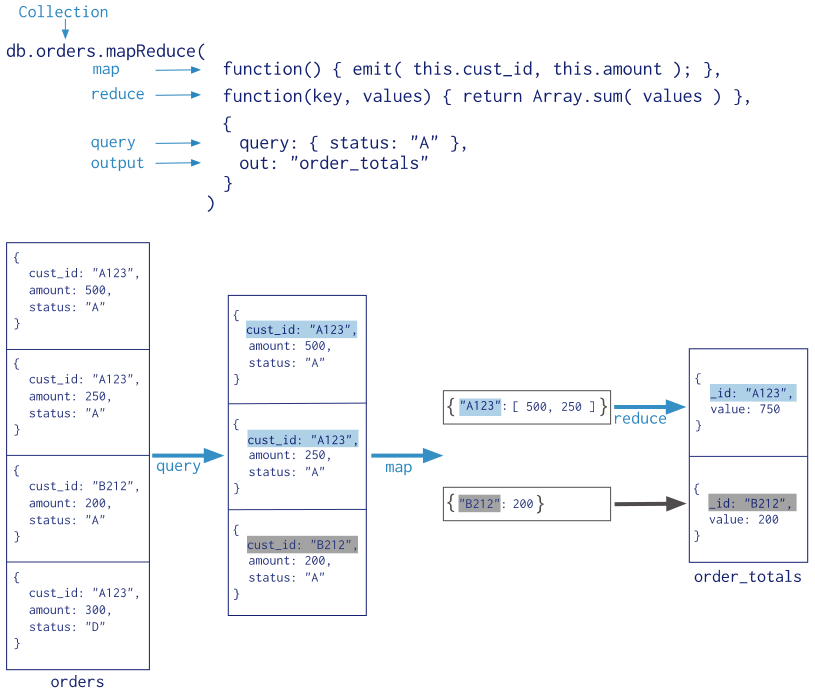

##聚合

## 概念

聚合操作处理数据记录并返回计算结果。聚合操作将来自多个文档的值组合在一起，并且可以对分组数据执行各种操作以返回单个结果 

## 类型

### 聚合管道（aggregation pipeline）

聚合管道是基于数据处理流水线概念建模的数据聚合框架。文档进入多阶段管道，将文档转换为聚合结果。该管道使用MongoDB中的本机操作提供高效的数据聚合，是MongoDB中数据聚合的首选方法。

### map-reduce函数（map-reduce function）

通常，map-reduce操作有两个阶段：一个*map*阶段，它处理每个文档并为每个输入文档*发出*一个或多个对象，并*减少*组合map操作输出的阶段。可选地，map-reduce可以具有 *最终化*阶段以对结果进行最终修改。与其他聚合操作一样，map-reduce可以指定查询条件以选择输入文档以及排序和限制结果。



### 单用途聚合方法（single purpose aggregation methods）

1. `db.collection.estimatedDocumentCount()`。
2. `db.collection.count()`。
3. `db.collection.distinct()`。

## 聚合框架

1. 用多个构件创建一个管道( pipeline ), 用于对一连串的文档进行处理。这些构件包括筛选（filtering）、投射（projecting）、分组（grouping）、排序（sorting）、限制（limiting）和跳过（skiping）。
2. 例子，你希望找出发表文章最多的的那个作者。假设每篇文章被保存为MongoDB中的一个文档，可以按照如下步骤创建管道
   * 将每个文章文档中的作者投射出来
   * 将作者按照名字排序,统计每个名字出现的次数
   * 将作者按照名字出现次数降序排序
   * 将返回结果限制为前5个
3. 步骤对应的操作
   * `{"$project":{"author":1}}` 这样可以将 `author` 从每个文档中投射出来 , 
     * 这个语法与查询中的字段选择器比较像 : 可以通过制定 `"fieldname":1` 选择需要投射的字段,或者通过制定 `"fieldname":0` 排除不需要的字段。__执行完这个操作, 结果集中的每个文档都会以{"_id":id,"author":"authorName"} 这样的形式表示。这些结果只会在内存中存在，不会被写入磁盘。__
   * `{"$group":{"_id":"$author","count":{"$sum":1}}}` 
     * 这里首先制定了需要进行分组的字段 "author"。这是有 `_id:"$author"`  指定的。
     * 第二段字段意思是为分组内每个文档的 `count` 字段加1。
   * `{"$sort":{"count":-1}}`
     * 对结果集中的文档根据 `"count"` 字段进行降序排序
   * `{"$limit":5}`
     * 返回结果限制为当前结果的前5个文档

### 管道操作符

1. `$match`

   * 用于对文档集合和进行筛选，之后就可以在筛选得倒的文档子集上做聚合。`$match` 可以使用所有常规的查询操作符 `$gt` `$lt`  `$in` 
   * 在实际使用中应该尽可能将 `$match` 放在管道的前面位置。这样做有两个好处：一是可以快速将不需要的文档过滤掉，以减少管道的工作量；二是如果在投射和分组之前执行 `$match` ， 查询可以使用索引。

2. `$project`

   * 使用 `$project` 操作时从文档中选择想要的字段。可以指定包含或者不包含一个字段。

   * 默认情况下，如果文档中存在 `_id` 字段，这个字段就会被返回。例如，可以将每个用户文档的 `_id` 在返回结果中重命名为 `userId`；

     ```html
     db.users.aggregate({"$project":{"userId":"$_id","_id":0}});
     ```

   * __必须明确指定将 `_id`排除，否则这个字段的值会被返回两次：一次被标为 “userId” ，一次被标为 “_id”。可以使用这种技术生成制度啊俺的多个副本，以便在之后的 “$group” 中使用。 

   * 可以在`$project`中使用的

     * 数学表达式

       ```javascript
       //将多 salary 和 bonus 字段的值相加
       db.employees.aggregate({
       	"$project":{
               "totalPay"{
       			"$add":{"$salary","$bonus"}
               }
       	}
       });
       ```

     * 其他常用的表达式

       - `"$add":{expr1,...exprN}`

         接受多个表达式作为参数，将这些表达式相加

       - `"$subtract":{expr1,expr2}`

         接受两个表达式作为参数， 用第一个表达式减去第二个表达式作为结果。

       - `"$multiply":{expr1,expr2}`

         接受一个或者多个表达式，并且将它们相乘

       - `"$divide":{expr1，expr2}`

         用第一个表达式除以第二个表达式的商作为结果。

       - `$mod:{expr1,expr2}`

         接受两个表达式， 将第一个表达式除以第二个表达式得倒的余数作为结果。

     * 字符串表达式 ( string expression )

     * 逻辑表达式

3. `$project` 分组

   `$sum` 求和、`$avg`平均 、`$max expr` 、`$min`  极致操作符、

   `$firsh` 、`$last` 这两个操作只有在排序之后，明确知道数据顺序时才有意义。

4. 数组操作符

   * `$addToSet:expr` 

     如果当前数组中不包含expr，那就将它添加到数组中。在返回结果中，每个元素最多只出现一次，而且元素的顺序是不确定的。

   * `$push：expr`

     不管expr是什么值， 都将它添加到数组中。返回包含所有值的数组。

5. `$unwind`

   * 拆分，可以将数组中的每一个值拆分为单独的文档。例如，如果有一篇拥有多条评论的博客文章，想要获取特定用户的评论

     ```javascript
     db.blog.aggregate(
         {"$project":{"comments":"$comments"}},
         {"$unwind":"$comments"},
         {"$match":{"comments.author":"Mark"}}
     );
     ```

6. `$sort`

   如果要对大量的文档进行排序，强烈建议在管道的第一简短进行排序，这时的排序操作可以使用索引。否则，排序过程就会比较慢，而且会占用大量内存。

### 使用管道

1. 应该尽量在管道的开始阶段执行 ( `$project`、`$group`、`$unwind` ) 操作，这样就将尽可能多的文档和字段过滤掉。
2. MongoDB不允许单一的聚合操作占用过多的系统内存，如果MongoDB发现某个集合操作占用了20%以上的内存，这个操作就会直接输出错误。
3. [php mongodb 聚合函数使用，可以参考](http://www.xuexiyuan.cn/article/detail/115.html)

