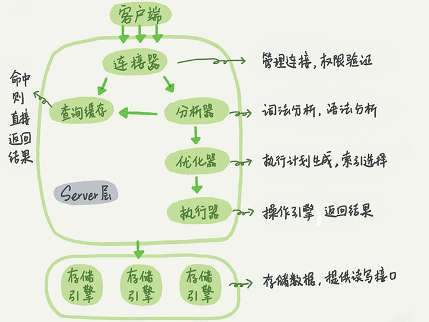

## 架构概括



1. Server 层包括连接器、查询缓存、分析器、优化器、执行器等，涵盖 MySQL 的大多数核心服务功能，以及所有的内置函数（如日期、数学和加密函数等），所有跨存储引擎的功能都在这一层实现，比如存储过程、触发器、视图。
2. 存储引擎层两部分。

### 连接器

连接器负责跟客户端建立连接、获取权限、维持和管理连接。

```mysql
mysql -h $ip -P $port -u $user -p
```

1. 查看连接状态 `show processlist` 

   

2. 客户端如果太长时间没动静，连接器就会自动将它断开。这个时间是由参数 `wait_timeout` 控制的，默认值是 8 小时。

   ```mysql
   #connect_timeout 指的是“连接过程中”的等待时间
   #wait_timeout 指的是“连接过程完成，使用过程中”的等待时间
   
   show global variables like 'wait_timeout';
   ```

#### 连接效率

1. 数据库中，长连接是指连接成功后，如果客户端持续有请求，则一直使用同一个连接。短连接则是指每次执行完很少的几次查询就断开连接，下次查询重新建立。
2. 如果全部使用长连接后，你可能会发现，有些时候 MySQL 占用内存涨得特别快，**这是因为 MySQL 在执行过程中临时使用的内存是管理在连接对象里面的。这些资源会在连接断开的时候才释放。**所以如果长连接累积下来，可能导致内存占用太大，被系统强行杀掉，从现象看就是 MySQL 异常重启。

#### 解决思路

1. 定期断开长连接。使用一段时间，或者程序里面判断执行过一个占用内存的大查询后，断开连接，之后要查询再重连。
2. 如果用的是 MySQL 5.7+ 版本，可以在每次执行一个比较大的操作后，通过执行 `mysql_reset_connection` 来重新初始化连接资源。这个过程不需要重连和重新做权限验证，会将连接恢复到刚刚创建完成时的状态。

### 查询缓存

MySQL 8.0 版本移除了整块功能。

### 分析器

分析阶段判断语句是否正确，表是否存在，列是否存在等。

### 优化器

优化器是在表里面有多个索引的时候，决定使用哪个索引；或者在一个语句有多表关联（join）的时候，决定各个表的连接顺序。

### 执行器

1. 开始执行的时候，要先判断一下对执行操作的表有没有执行权限。如果没有，就会返回没有权限的错误。

   ```mysql
   select * from user where id=10
   ```

2. 如果有权限，打开表的时候，执行器就会根据表的引擎定义，去使用这个引擎提供的接口。

3. 慢查询日志中， `rows_examined` 字段，表示这个语句执行过程中扫描了多少行。

#### 执行流程

1. 调用 InnoDB 引擎接口取这个表的第一行，判断 ID 值是不是 10，如果不是则跳过，如果是则将这行存在结果集中。
2. 调用引擎接口取下一行。重复相同的判断逻辑，直到取到这个表的最后一行。
3. 执行器将遍历过程中所有满足条件的行组成的记录集作为结果集返回给客户端。

## 日志系统

### redo log（InnoDB特有的日志）

1. 在 MySQL 里，如果每一次的更新操作都需要写进磁盘，然后磁盘也要找到对应的那条记录，然后再更新，整个过程 IO 成本、查找成本都很高。为了解决这个问题， MySQL 引入了 WAL 技术，WAL 的全称是 Write-Ahead Logging，它的关键点就是先写日志，再写磁盘。
2. 当有一条记录需要更新的时候，InnoDB 引擎就会先把记录写到 redo log 里面，并更新内存，这个时候更新就算完成了。同时，InnoDB 引擎会在适当的时候，将这个操作记录更新到磁盘里面，而这个更新往往是在系统比较空闲的时候做。

### binlog（Sever 层的日志）

### 两个日志区别

1. redo log 是 InnoDB 引擎特有的；binlog 是 MySQL 的 Server 层实现的，所有引擎都可以使用。
2. redo log 是物理日志，记录的是“在某个数据页上做了什么修改”；binlog 是逻辑日志，记录的是这个语句的原始逻辑，比如“给 ID=2 这一行的 c 字段加 1 ”。
3. redo log 是循环写的，空间固定会用完；binlog 是可以追加写入的。“追加写”是指 binlog 文件写到一定大小后会切换到下一个，并不会覆盖以前的日志。

### 两阶段提交

1. 写入 redo log 处于 prepare 阶段。
2. 写入 binlog。
3. 提交（commit）。

####  异常恢复

1. 当在2之前崩溃时，重启恢复：发现没有 commit，回滚。备份恢复：没有 binlog。（数据一致）
2. 当在3之前奔溃时，重启恢复：虽没有 commit，但满足 prepare 和 binlog 完整，所以重启后会自动 commit。备份恢复：有binlog。（数据一致）

## 事务隔离

ACID（Atomicity、Consistency、Isolation、Durability，即原子性、一致性、隔离性、持久性）

### 隔离级别

1. 读未提交（read uncommitted）是指，一个事务还没有提交时，它做的变更就能被别的事务看到。

2. 读提交（read committed）是指，一个事务提交之后，它做的变更才会被其他事务看到。

3. 可重复读（repeatable read）是指，一个事务执行过程中看到的数据，总是跟这个事务在启动时看到的数据时一致的。当然在可重复读隔离级别下，未提交变更对其他事务也是不可见的。

4. 串行化（serializable），是对于同一行记录，“写”会加“写锁”，“读”会加“读锁”。当出现读写锁冲突的时候，后访问的事务必须等前一个事务执行完成，才能继续执行。

### 说明


1. 若隔离级别是“读未提交”， 则 V1 的值就是 2。这时候事务 B 虽然还没有提交，但是结果已经被 A 看到了。因此，V2、V3 也都是 2。
2. 若隔离级别是“读提交”，则 V1 是 1，V2 的值是 2。事务 B 的更新在提交后才能被 A 看到。所以， V3 的值也是 2。
3. 若隔离级别是“可重复读”，则 V1、V2 是 1，V3 是 2。之所以 V2 还是 1，遵循的就是这个要求：事务在执行期间看到的数据前后必须是一致的。
4. 若隔离级别是“串行化”，则在事务 B 执行“将 1 改成 2”的时候，会被锁住。直到事务 A 提交后，事务 B 才可以继续执行。所以从 A 的角度看， V1、V2 值是 1，V3 的值是 2。

### 查看

1. 查看当前会话隔离级别

   ```mysql
   select@@tx_isolation;
   ```

2. 查看系统当前隔离级别

   ```mysql
   select @@global.tx_isolation;
   ```

3. 设置当前会话隔离级别

   ```mysql
   set session transaction isolation level repeatable read;
   ```

4. 设置系统当前隔离级别

   ```mysql
   set global transaction isolation level repeatable read;
   ```

### 实现


