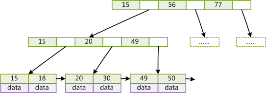

# 索引

MySQL 中，索引是在存储引擎层实现的，所以没有统一的索引标准，不同存储引擎的索引的工作方式并不一样。

## 基础

1. 索引提高了查询速度降低了增删改的数据，并非加的越多越好。
2. MySQL中， 存储引擎用类似的方法使用索引，其先在索引中找到对应值，然后根据匹配的索引记录找到对应的数据行。
3. 索引可以包含一个或者多个列的值。如果索引包含多个列，那么列的顺序也十分重要，因为**MySQL只能高效使用索引的最左前缀列。**

## 原理B+Tree [引用](https://www.jianshu.com/p/486a514b0ded)

1. 与B-Tree相比，B+Tree有以下不同点：非叶子节点不存储data，只存储索引key；只有叶子节点才存储data。结构如下图：


2. Mysql中B+Tree**：在经典B+Tree的基础上进行了优化，增加了顺序访问指针。在B+Tree的每个叶子节点增加一个指向相邻叶子节点的指针，就形成了**带有顺序访问指针的B+Tree**。这样就**提高了区间访问性能**：如果要查询key为从18到49的所有数据记录，当找到18后，只需顺着节点和指针顺序遍历就可以一次性访问到所有数据节点，极大提到了区间查询效率(**无需返回上层父节点重复遍历查找减少IO操作)。



3. 在 InnoDB 中，每个数据页的大小默认是 16KB。

## 回表


1. 主键索引的叶子节点存的是整行数据。在 InnoDB 里，主键索引也被称为聚簇索引。
2. 非主键索引的叶子节点内容是主键的值。在 InnoDB 里，非主键索引也被称为二级索引。
3. 基于主键索引和普通索引的查询区别。
   - 如果语句是 `select * from t where id = 500` ,即主键查询方式，则只需要搜索主键那棵 B+ 树。
   - 如果语句是 `select * from t where k = 5` ，即普通索引查询方式，则需要先搜索 k 索引树，得到 ID 的值为 500，再到 ID索引树搜索一次，这个过程称为 **回表**。

## 索引维护

1. 如果插入新的行 ID 值为700，则只需要在 R5 的记录后面插入一个新纪录。
2. 如果新插入的 ID 值为400，需要逻辑上挪动后面的数据，空出位置。（当前页没有满的情况下）
3. 如果 R5 所在的数据页已经满了，这个时候要申请一个新的数据页，然后挪动部分数据过去。这个过程称为**页分裂**。
4. 当相邻两个页由于删除了数据，利用率很低之后，会将数据页做合并。合并的过程，可以认为是分裂过程的逆过程。

## 自增主键

1. **主键长度越小，普通索引的叶子节点就越小，普通索引占用的空间也就越小。**
2. **直接删掉主键索引是不好的，它会使得所有的二级索引都失效，并且会用ROWID来作主键索引；**
3. 自增主键的插入数据模式，正符合了递增插入的场景。每次插入一条新纪录，都是追加操作，都不涉及到挪动其他记录，也不触发叶子节点的分裂。
4. 有业务逻辑的字段做主键，则往往不容易保证有序插入，这样写数据成本相对较高。**在特殊情况下，也是可以使用业务字段直接做主键的**：表中只有一个业务字段一个索引，并且该索引必须是唯一索引。这样就可以避免每次查询需要搜索两棵树。

## 索引下推

1. 假设用户表的联合索引（name,age），如果执行 `select * from user where name like '张%' and  age = 10` ,这个语句在搜索索引树的时候，利用**最左前缀** 找到第一个满足条件的记录。然后呢？
2. 在 MySQL5.6 之前，只能从找到主键开始一个个回表。到主键索引上找出数据行，再对比字段值。而 MySQL5.6 引入的索引下推优化，可以在索引便利过程中，对索引中包含的字段先做判断，直接过滤掉不满足条件的记录，减少回表次数。

## 索引长度 

1. 建立索引时，可以只索引列的前一部分的内容，比如前10个字符。例如 email 后面的字符都是一些区分度不高的，就没必要建立索引浪费资源。

   ```mysql
   #追加索引
   create unique index email on tbl_users(email(10));
   ```

2. 在为 `CHAR` 和 `VARCHAR` 类型的数据列定义索引时，可以把索引的长度限制为一个给定的字符个数（这个数字必须小于这个字段所允许的最大字符个数）。这么做的好处是可以生成一个尺寸比较小、检索速度却比较快的索引文件。

## 索引类型

### 普通索引

普通索引（由关键字KEY或INDEX定义的索引）的唯一任务是加快对数据的访问速度。因此，应该只为那些最经常出现在查询条件（WHERE column=）或排序条件（ORDER BY column）中的数据列创建索引。只要有可能，就应该选择一个数据最整齐、最紧凑的数据列（如一个整数类型的数据列）来创建索引。

### 唯一索引

如果能确定某个数据列将只包含彼此各不相同的值，在为这个数据列创建索引的时候就应该用关键字`UNIQUE`把它定义为一个唯一索引。

### 主键索引

必须为主键字段创建一个索引，这个索引就是所谓的“主索引”。

### 全文索引

1. 在中文状态下几乎无效，__要分词+索引，一般用第三方解决方案，如 sphinx__ 
2. **注解：InnoDB数据表不支持全文索引。**

### 外键索引

如果为某个外键字段定义了一个外键约束条件，MySQL就会定义一个内部索引来帮助自己以最有效率的方式去管理和使用外键约束条件。 

###多列索引

在t_user表id，userName，email字段上创建多列索引（该表只有此索引）：

```mysql
alter table t_user add index USER_INDEX(id，userName，email);
```

组合索引的生效原则是从前往后依次使用生效，如果中间某个索引没有使用，那么断点前面的索引部分起作用，断点后面的索引没有起作用__给 a，b，c三列建立索引__ 

```
(0)    select * from mytable where a=3 and b=5 and c=4;
abc三个索引都在where条件里面用到了，而且都发挥了作用
(1)    select * from mytable where  c=4 and b=6 and a=3;
这条语句列出来只想说明 mysql没有那么笨，where里面的条件顺序在查询之前会被mysql自动优化，效果跟上一句一样
(2)    select * from mytable where a=3 and c=7;
a用到索引，b没有用，所以c是没有用到索引效果的
(3)    select * from mytable where a=3 and b>7 and c=3;
a用到了，b也用到了，c没有用到，这个地方b是范围值，也算断点，只不过自身用到了索引
(4)    select * from mytable where b=3 and c=4;
因为a索引没有使用，所以这里 bc都没有用上索引效果
(5)    select * from mytable where a>4 and b=7 and c=9;
a用到了  b没有使用，c没有使用
(6)    select * from mytable where a=3 order by b;
a用到了索引，b在结果排序中也用到了索引的效果，前面说了，a下面任意一段的b是排好序的
(7)    select * from mytable where a=3 order by c;
a用到了索引，但是这个地方c没有发挥排序效果，因为中间断点了，使用 explain 可以看到 filesort
(8)    select * from mytable where b=3 order by a;
b没有用到索引，排序中a也没有发挥索引效果

```

### 覆盖索引

1. `select ID from T where k between 3 and 5` ，这时只需要查 ID 的值，而 ID 的值已经在 k 索引树上了。因此可以直接提供查询结果，不需要回表。这样的查询称为 **覆盖查询** 
2. 覆盖索引可以减少树的搜索次数，显著提升查询性能。
3. 覆盖索引的目的就是”不回表“，所以只有索引包含了where条件部分和select返回部分的所有字段，才能实现这个目的。

### 最左前缀

1. 联合索引是可以利用最左前缀的规则的。
2. 在建立联合索引的时候，如何安排索引内的字段顺序：第一原则是，如果通过调整顺序，可以少维护一个索引，那么这个顺序往往就是需要优先考虑采用的。
3. 如果即有联合查询（a,b），又有基于 a、b各自的查询，这时候查询条件只有 b 的语句，是无法使用（a，b）这个联合索引的。这时候不得不维护另外一个索引，也就是说需要同时维护（a，b）、（b）这两个索引。这时候需要**考虑的原则就是空间，将占用字节小得设置为单字段索引** 。

## 重建索引

索引可能因为删除，或者页分裂等原因，导致数据页有空洞，重建索引的过程会创建一个新的索引，把数据按顺序插入，这样页面的利用率最高，也就是索引更紧凑、更省空间。

不论是删除主键还是创建主键，都会将整个表索引重建。`alter table T engine=InnoDB` 

## 不应该创建索引的列

1. 在查询中很少使用的列上不应该创建索引，因为这些列很少使用到，因此有索引或无索引，并不能提高查询速度，相反由于增加了索引，反而降低了系统维护速度，增大了空间需求；
2. 在只有很少数据值的列上不应该创建索引，很少数据值的列如性别等，在查询的结果中，结果集的数据行占了表中数据行的很大比例，即需要在表中搜索的数据行的比例很大，增加索引，并不能明显加快检索速度；
3. 当修改性能远远大于检索性能时，不应该创建索引，因为改性能和检索性能是互相矛盾的，当增加索引时，会提高检索性能，但会降低修改性能，当减少索引时，会提高修改性能，但会降低检索性能。因此，当修改性能远大于检索性能时，不应该创建索引。

## 索引策略

### 使用索引扫描来做排序

1. 扫描索引本身是很快的，但如果索引不能覆盖查询所需的全部列，那就不得不每扫描一条索引记录就都回表查询一次对应的行。这基本上都是随机 I/O。

   ```mysql
   # 索引 group_region_id(主键) cutoff_time(普通)
   # 不能使用索引排序
   explain select group_region_id from group_region order by cutoff_time desc 
   # 可以使用索引排序
   explain select group_region_id from group_region order by cutoff_time desc 
   ```

2. **如果 Explain 出来的 type 列的值为 “index”，则说明使用索引扫描来做排序。**

   

   

3. 如果查询需要关联多张表，则只有当 `order by` 子句引用的字段全部为第一个表时，才能使用索引做排序。

### 延迟关联

1. 在下面这种情况是无法使用覆盖索引的，因为需要获取所有的数据列。

   ```mysql
   explain select * from shop_user where nick_name like '佑佑%'
   ```

2. 因为延迟了对列的访问，在查询的第一阶段 mysql 可以使用覆盖索引，优化效果取决于在外层查询匹配获取需要的所有列值和数据数量。

   ```mysql
   explain select
       *
       from
   	shop_user
   	user join ( select user_id from shop_user where nickname like '佑佑%' ) as user_tmp on user_tmp.user_id = user.user_id
   ```

3. 优化排序

   ```mysql
   explain select
   	gr.*
   from
   	group_region gr
   	join (select group_region_id from group_region order by cutoff_time desc) as tmp on tmp.group_region_id = gr.group_region_id
   	join group g on g.group_id = gr.group_id
   ```

### 索引和锁

