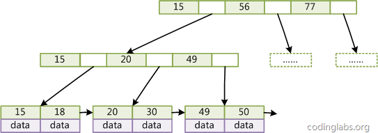

# MySQL

## MySQL的逻辑架构图

## 日志系统

### redo log（InnoDB特有的日志）

1. MySQL 的 WAL 技术，全称 write-Ahead Logging，它的关键点就是先写日志，再写磁盘。
2. **描述** 当有一条记录需要更新的时候，InnoDB 引擎就会先把记录写到 `redo log` 中，并更新内存，这个时候更新就算完成了。同时，InnoDB 引擎会在适当的时候，将这个操作记录更新到磁盘里面，而这个更新往往是在系统比较空闲的时候做。
3. InnoDB 的 `redo log` 是固定大小的，比如可以配置一组4个文件，每个文件的大小是1GB。一共可以记录4GB的操作。从头开始写，写到末尾就有回到开头循环写。
4. 有了 `redo log` ，InnoDB 就可以保证即使数据库发生异常重启，之前提交的记录都不会丢失，这个能力称为 `crash-safe`。

### binlog（Sever 层的日志）

### 区别

1. `redo log` 是 InnoDB 引擎特有的；`bin log` 是MySQL的Server层实现的，所有引擎都可以使用。
2. `redo log` 是物理日志，记录的是“在某个数据页上做了什么修改”；`bin log`  是逻辑日志，记录的是这个语句的原始逻辑，比如“给ID=2这一行的 c 字段加1”。
3. `redo log` 是循环写的，空间固定会用完；`bin log` 是可以追加写入的。“追加写”是指 `bin log` 文件写到一定大小后会切换到下一个，并不会覆盖以前的日志。

### 配置

1. `redo log` 用于保证 crash-safe 能力。 `innodb_flush_log_at_trx_commit` 这个参数设置成1的时候，表示每次事务的 `redo log` 都直接持久化到磁盘。这样可以保证 MySQL 异常重启之后数据不丢失。

2. `sync_binlog` 这个参数设置成1的时候，表示每次事务的 `bin log` 持久化到磁盘。这样可以保证 MySQL 异常重启之后 `bin log`  不丢失。

## 事务隔离

### 基础概念

1. **ACID** 即原子性、一致性、隔离性、持久性。
2. MySQL 中，事务支持是在引擎层实现的。
3. SQL 标准的事务隔离级别包括：读未提交，读提交、可重复读和串行化。
   * 读未提交是指，一个事务还没有提交时，它做的变更就能被别的事务看到。
   * 读提交是指，一个事务提交之后，它做的变更才会被其他事务看到。
   * 可重复读是指，一个事务执行过程中看到的数据，总是跟这个事务在启动时看到的数据时一致的。当然在可重复读隔离级别下，未提交变更对其他事务也是不可见的。
   * 串行化，是对于同一行记录，“写”会加“写锁”，“读”会加“读锁”。当出现读写锁冲突的时候，后访问的事务必须等前一个事务执行完成，才能继续执行。
4. 在实现上，数据库里面会创建一个视图，访问的时候以视图的逻辑结果为准。
   * 在“可重复读”隔离级别下，这个视图是在事务启动时创建的，整个事务存在期间都用这个视图。
   * 在“读提交”隔离级别下，这个视图是在每个 SQL 语句开始执行的时候创建的。
   * “读未提交”隔离级别下直接返回记录上的最新值，没有视图概念；
   * “串行化”隔离级别下直接用加锁的方式来避免并行访问。
5. 使用场景
   * ”可重复读“：假设管理一个个人银行账户表。一个表存了每个月月底的余额，一个表存了账单明细。这时候你要做数据校对，也就是判断上个月的余额和当前余额的差额，是否与本月的账单明细一致。你一定希望在校对过程中，即使有用户发生了一笔新的交易，也不影响你的校对结果。

### 注意事项

1. 长事务意味着系统里面会存在很老的事务视图。由于这些事务随时可能访问数据里面的任何数据，所以这个事务提交之前，数据库里面它可能用到的回滚记录都必须保留，这就会导致大量占用存储空间。

## 索引

### 常用索引模型

1. 哈希表。优势是增加新的数据速度会很快，只需要往后追加。但是缺点是，因为不是有序的，所以哈希索引做区间查询的速度是很慢的。**哈希表这中结构适用于只有等值查询的场景**。
2. 有序数组，在等值查询和范围查询场景中的性能就都非常优秀。但是如果往中间插入一条记录就必须得挪动后面所有的记录。**有序数组索引只适用于静态存储引擎**。
3. 搜索树

### InnoDB 的索引模型

1. [简书索引介绍](https://www.jianshu.com/p/486a514b0ded)

2. MySQL 中，索引是在存储引擎层实现的，所以没有统一的索引标准，不同存储引擎的索引的工作方式并不一样。

3. 在 InnoDB 中，表都是根据主键顺序以索引的形式存放的，这种存储方式的表称为**索引组织表**。

4. **B+Tree**

   * 与B-Tree相比，B+Tree有以下不同点：非叶子节点不存储data，只存储索引key；只有叶子节点才存储data。结构如下图：

     

   * Mysql中B+Tree**：在经典B+Tree的基础上进行了优化，增加了顺序访问指针。在B+Tree的每个叶子节点增加一个指向相邻叶子节点的指针，就形成了**带有顺序访问指针的B+Tree**。这样就**提高了区间访问性能**：如果要查询key为从18到49的所有数据记录，当找到18后，只需顺着节点和指针顺序遍历就可以一次性访问到所有数据节点，极大提到了区间查询效率(**无需返回上层父节点重复遍历查找减少IO操作)。

     

### InnoDB

1. 主键索引的叶子节点存的是整行数据。在 InnoDB 里，主键索引也被称为聚簇索引。
2. 非主键索引的叶子节点内容是主键的值。在 InnoDB 里，非主键索引也被称为二级索引。
3. 基于主键索引和普通索引的查询区别。
   * 如果语句是 `select * from t where id = 500` ,即主键查询方式，则只需要搜索主键那棵 B+ 树。
   * 如果语句是 `select * from t where k = 5` , 即普通索引查询方式，则需要先搜索 k 索引树，得到 ID 的值为 500，再到 ID索引树搜索一次，这个过程称为 **回表**。

### 索引维护

1. 如果插入新的行 ID 值为700，则只需要在 R5 的记录后面插入一个新纪录。
2. 如果新插入的 ID 值为400，需要逻辑上挪动后面的数据，空出位置。（当前页没有满的情况下）
3. 如果 R5 所在的数据页已经满了，这个时候要申请一个新的数据页，然后挪动部分数据过去。这个过程称为**页分裂**。
4. 当相邻两个页由于删除了数据，利用率很低之后，会将数据页做合并。合并的过程，可以认为是分裂过程的逆过程。

### 自增主键的作用

1. 自增主键的插入数据模式，正符合了递增插入的场景。每次插入一条新纪录，都是追加操作，都不涉及到挪动其他记录，也不触发叶子节点的分裂。

2. 主键长度越小，普通索引的叶子节点就越小，普通索引占用的空间也就越小。

3. 使用**业务字段直接做主键** 的情况：只有一个索引，并且该索引必须是唯一索引。这样可以避免每次查询需要搜索两棵树。
