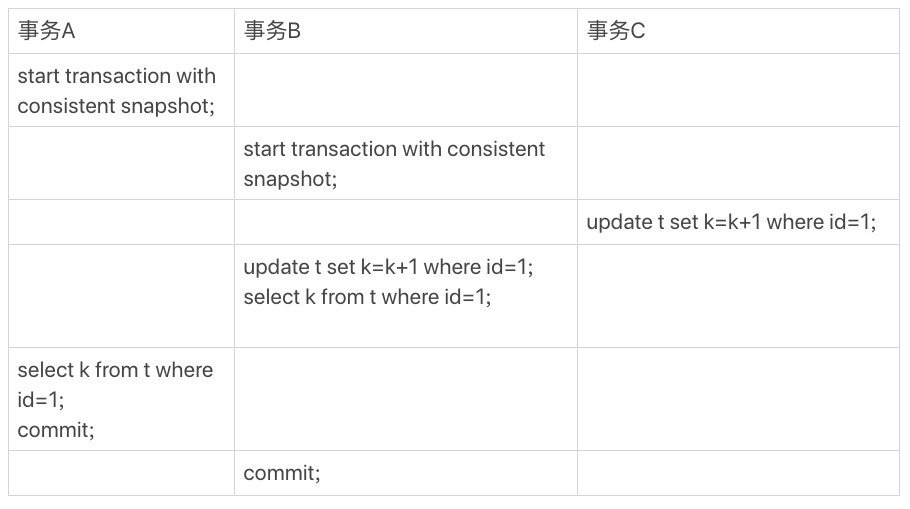
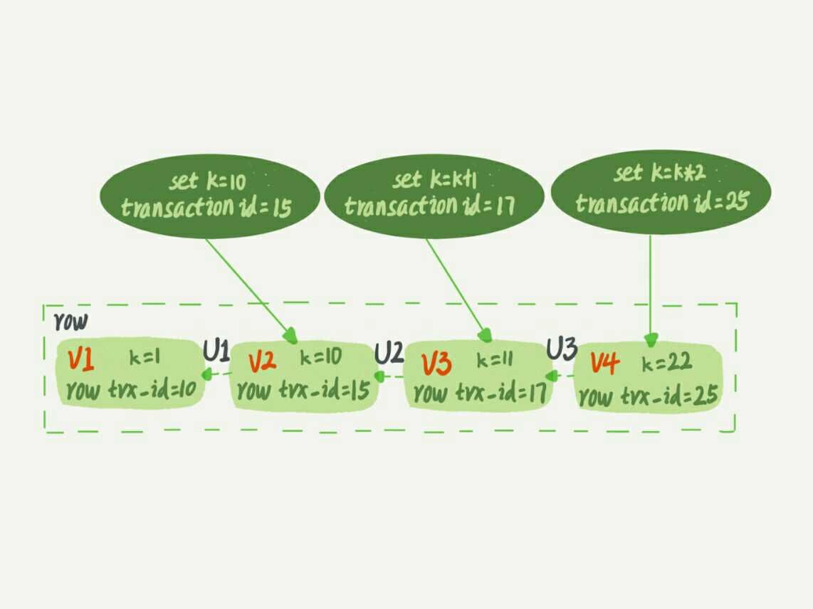

# MySQL

## MySQL的逻辑架构图


## 日志系统

### redo log（InnoDB特有的日志）

1. MySQL 的 WAL 技术，全称 write-Ahead Logging，它的关键点就是先写日志，再写内存。
2. **描述** 当有一条记录需要更新的时候，InnoDB 引擎就会先把记录写到 `redo log` 中，并更新内存，这个时候更新就算完成了。同时，InnoDB 引擎会在适当的时候，将这个操作记录更新到磁盘里面，而这个更新往往是在系统比较空闲的时候做。
3. InnoDB 的 `redo log` 是固定大小的，比如可以配置一组4个文件，每个文件的大小是1GB。一共可以记录4GB的操作。从头开始写，写到末尾就有回到开头循环写。
4. 有了 `redo log` ，InnoDB 就可以保证即使数据库发生异常重启，之前提交的记录都不会丢失，这个能力称为 `crash-safe`。

### binlog（Sever 层的日志）

### 区别

1. `redo log` 是 InnoDB 引擎特有的；`bin log` 是MySQL的Server层实现的，所有引擎都可以使用。
2. `redo log` 是物理日志，记录的是“在某个数据页上做了什么修改”；`bin log`  是逻辑日志，记录的是这个语句的原始逻辑，比如“给ID=2这一行的 c 字段加1”。
3. `redo log` 是循环写的，空间固定会用完；`bin log` 是可以追加写入的。“追加写”是指 `bin log` 文件写到一定大小后会切换到下一个，并不会覆盖以前的日志。

### 配置

1. `redo log` 用于保证 crash-safe 能力。 `innodb_flush_log_at_trx_commit` 这个参数设置成1的时候，表示每次事务的 `redo log` 都直接持久化到磁盘。这样可以保证 MySQL 异常重启之后数据不丢失。

2. `sync_binlog` 这个参数设置成1的时候，表示每次事务的 `bin log` 持久化到磁盘。这样可以保证 MySQL 异常重启之后 `bin log`  不丢失。

## 事务隔离

### 基础概念

1. **ACID** 即原子性、一致性、隔离性、持久性。

2. MySQL 中，事务支持是在引擎层实现的。

3. SQL 标准的事务隔离级别包括：读未提交，读提交、可重复读和串行化。
   * 读未提交是指，一个事务还没有提交时，它做的变更就能被别的事务看到。
   * 读提交是指，一个事务提交之后，它做的变更才会被其他事务看到。
   * 可重复读是指，一个事务执行过程中看到的数据，总是跟这个事务在启动时看到的数据时一致的。当然在可重复读隔离级别下，未提交变更对其他事务也是不可见的。
   * 串行化，是对于同一行记录，“写”会加“写锁”，“读”会加“读锁”。当出现读写锁冲突的时候，后访问的事务必须等前一个事务执行完成，才能继续执行。

4. 在实现上，数据库里面会创建一个视图，访问的时候以视图的逻辑结果为准。
   * 在“可重复读”隔离级别下，这个视图是在事务启动时创建的，整个事务存在期间都用这个视图。
   * 在“读提交”隔离级别下，这个视图是在每个 SQL 语句开始执行的时候创建的。
   * “读未提交”隔离级别下直接返回记录上的最新值，没有视图概念；
   * “串行化”隔离级别下直接用加锁的方式来避免并行访问。

5. 使用场景

   * ”可重复读“：假设管理一个个人银行账户表。一个表存了每个月月底的余额，一个表存了账单明细。这时候你要做数据校对，也就是判断上个月的余额和当前余额的差额，是否与本月的账单明细一致。你一定希望在校对过程中，即使有用户发生了一笔新的交易，也不影响你的校对结果。

6. 查看当前数据库的隔离级别

   * 查看当前会话隔离级别

     ```mysql
     select@@tx_isolation;
     ```

   * 查看系统当前隔离级别

     ```mysql
     select @@global.tx_isolation;
     ```

   * 设置当前会话隔离级别

     ```mysql
     set session transaction isolation level repeatable read;
     ```

   * 设置系统当前隔离级别

     ```mysql
     set global transaction isolation level repeatable read;
     ```

### 注意事项

1. 长事务意味着系统里面会存在很老的事务视图。由于这些事务随时可能访问数据里面的任何数据，所以这个事务提交之前，数据库里面它可能用到的回滚记录都必须保留，这就会导致大量占用存储空间。

## 索引

### 常用索引模型

1. 哈希表。优势是增加新的数据速度会很快，只需要往后追加。但是缺点是，因为不是有序的，所以哈希索引做区间查询的速度是很慢的。**哈希表这种结构适用于只有等值查询的场景**。
2. 有序数组，在等值查询和范围查询场景中的性能就都非常优秀。但是如果往中间插入一条记录就必须得挪动后面所有的记录。**有序数组索引只适用于静态存储引擎**。
3. 搜索树

### InnoDB 的索引模型

1. [简书索引介绍](https://www.jianshu.com/p/486a514b0ded)

2. MySQL 中，索引是在存储引擎层实现的，所以没有统一的索引标准，不同存储引擎的索引的工作方式并不一样。

3. 在 InnoDB 中，表都是根据主键顺序以索引的形式存放的，这种存储方式的表称为**索引组织表**。

4. **B+Tree**

   * 与B-Tree相比，B+Tree有以下不同点：非叶子节点不存储data，只存储索引key；只有叶子节点才存储data。结构如下图：

     

   * Mysql中B+Tree**：在经典B+Tree的基础上进行了优化，增加了顺序访问指针。在B+Tree的每个叶子节点增加一个指向相邻叶子节点的指针，就形成了**带有顺序访问指针的B+Tree**。这样就**提高了区间访问性能**：如果要查询key为从18到49的所有数据记录，当找到18后，只需顺着节点和指针顺序遍历就可以一次性访问到所有数据节点，极大提到了区间查询效率(**无需返回上层父节点重复遍历查找减少IO操作)。

     

### InnoDB


1. 主键索引的叶子节点存的是整行数据。在 InnoDB 里，主键索引也被称为聚簇索引。
2. 非主键索引的叶子节点内容是主键的值。在 InnoDB 里，非主键索引也被称为二级索引。
3. 基于主键索引和普通索引的查询区别。
   * 如果语句是 `select * from t where id = 500` ,即主键查询方式，则只需要搜索主键那棵 B+ 树。
   * 如果语句是 `select * from t where k = 5` , 即普通索引查询方式，则需要先搜索 k 索引树，得到 ID 的值为 500，再到 ID索引树搜索一次，这个过程称为 **回表**。

### 索引维护

1. 如果插入新的行 ID 值为700，则只需要在 R5 的记录后面插入一个新纪录。
2. 如果新插入的 ID 值为400，需要逻辑上挪动后面的数据，空出位置。（当前页没有满的情况下）
3. 如果 R5 所在的数据页已经满了，这个时候要申请一个新的数据页，然后挪动部分数据过去。这个过程称为**页分裂**。
4. 当相邻两个页由于删除了数据，利用率很低之后，会将数据页做合并。合并的过程，可以认为是分裂过程的逆过程。

### 自增主键的作用

1. 自增主键的插入数据模式，正符合了递增插入的场景。每次插入一条新纪录，都是追加操作，都不涉及到挪动其他记录，也不触发叶子节点的分裂。
2. 主键长度越小，普通索引的叶子节点就越小，普通索引占用的空间也就越小。
3. 使用**业务字段直接做主键** 的情况：只有一个索引，并且该索引必须是唯一索引。这样可以避免每次查询需要搜索两棵树。

### 为什么要重建索引。

索引可能因为删除，或者页分裂等原因，导致数据页有空洞，重建索引的过程会创建一个新的索引，把数据按顺序插入，这样页面的利用率最高，也就是索引更紧凑、更省空间。

不论是删除主键还是创建主键，都会将整个表索引重建。`alter table T engine=InnoDB` 

### 覆盖索引 (k字段有索引)

1. `select ID from T where k between 3 and 5` ，这时只需要查 ID 的值，而 ID 的值已经在 k 索引树上了。因此可以直接提供查询结果，不需要回表。这样的查询称为 **覆盖查询** 
2. 覆盖索引可以减少树的搜索次数，显著提升查询性能。
3. 需要注意的是，在引擎内部使用覆盖索引在索引 k 上其实读了三个纪录（查询k==3，k==5，k == 6不满足条件结束），但是对于 MySQL 的 Server 层来说，它就是找引擎拿到了两条记录，因此 MySQL 认为扫描行数是2。

### 最左前缀

1. 联合索引是可以利用最左前缀的规则的。
2. 在建立联合索引的时候，如何安排索引内的字段顺序：第一原则是，如果通过调整顺序，可以少维护一个索引，那么这个顺序往往就是需要优先考虑采用的。
3. 如果即有联合查询（a,b），又有基于 a、b各自的查询，这时候查询条件只有 b 的语句，是无法使用（a，b）这个联合索引的。这时候不得不维护另外一个索引，也就是说需要同时维护（a，b）、（b）这两个索引。这时候需要**考虑的原则就是空间，将占用字节小得设置为单字段索引** 。

### 索引下推

假设用户表的联合索引（name,age），如果执行 `select * from user where name like '张%' and  age = 10` ,这个语句在搜索索引树的时候，利用**最左前缀** 找到第一个满足条件的记录。然后呢？

在 MySQL5.6 之前，只能从找到主键开始一个个回表。到主键索引上找出数据行，再对比字段值。而 MySQL5.6 引入的索引下推优化，可以在索引便利过程中，对索引中包含的字段先做判断，直接过滤掉不满足条件的记录，减少回表次数。

## MySQL 的锁

根据加锁的范围，MySQL 里面的锁大致可以分成全局锁、表级锁和行锁三类。

### 全局锁

1. 命令： `flush tables with read lock` 简称 FTWRL。

2. 作用：让整个库处于只读状态，使其他线程的以下语句会被阻塞：数据更新语句（数据的增删改）、数据定义语句（包括建表、修改表结构）和更新类事务的提交语句。

3. 场景：做全库逻辑备份。

4. 影响：

   * 如果在主库上备份，那么在备份期间都不能执行更新，业务基本上就得停摆。
   * 如果你在从库上备份，那么备份期间从库不能执行主库同步过来的 binlog，会导致主从延迟。

5. 代替命令

   * 官方自带的逻辑备份工具是 mysqldump。使用 `--single-transaction` 的时候，导数据之前会启动一个事务，来确保拿到一致性视图。（在可重复读隔离级别下开启一个事务）

   * `--single-transaction` 方法只适用于所有的表使用事务引擎的库，如果有的表使用了不支持事务的引擎，那么备份就只能通过 FTWRL 方法。
   * 执行 `mysqldump --help|more` 查看详细参数。

### 表级锁

1. MySQL 中表级别的锁有两种：一种是表锁，一种是元数据锁（meta data lock 简称 MDL）。

#### 表锁

1. 命令：

   ```mysql
   LOCK TABLES
       tbl_name [[AS] alias] lock_type
       [, tbl_name [[AS] alias] lock_type] ...
   
   lock_type: {
       READ [LOCAL]
     | [LOW_PRIORITY] WRITE
   }
   
   UNLOCK TABLES #主动释放，也可以在客户端断开的时候自动释放
   ```

2. 影响：

   除了会限制别的线程的读写外，也限定了本线程接下来的操作对象。例如：如果在某个线程 A 中执行 `lock tables t1 read,t2 write` 这个语句，则其他线程写 t1、读写 t2 的语句都会被阻塞。同时，线程 A 在执行 `unlock tables ` 之前，也只能执行读 t1、读写 t2 的操作。

#### 元数据锁（MDL）

1. MDL 不需要显式使用，在访问一个表的时候会被自动加上。MDL 的作用是，保证读写的正确性。

2. MySQL 5.5版本中引入了 MDL，当对一个表做增删改查询操作的时候，加 MDL 读锁；当要对表结构变更操作的时候，加 MDL 写锁。

   - 读锁之间不互斥，因此可以有多个线程同时对一张表增删改查。
   - 读写锁之间、写锁之间是互斥，用来保证变更表结构操作的安全性。

3. 使用场景

   如果一个查询正在遍历一个表中的数据，而执行期间另一个线程对这个表结构做变更，删了一列，那么查询线程拿到的结果跟表结构对不上，肯定是不行的。

4. **坑** ：给一个小表加个字段，导致整个库挂了。

### 行锁

MySQL 的行锁是在引擎层由各个引擎自己实现的。

#### 两阶段锁


上图事务 B 的 update 语句会被阻塞，直到事务 A 执行 commit 之后，事务 B 才能继续执行。

1. **在 InnoDB 事务中，行锁是在需要的时候才加上的，但并不是不需要了就立刻释放，而是等到事务结束时才释放。这个就是两阶段锁协议。** 
2. 优化：**如果在事务中需要锁多个行，要把最可能造成锁冲突、最可能影响并发度的锁尽量往后放。**

#### 死锁和死锁检测


这时候，事务 A 在等待事务 B 释放 id = 2的行锁，而事务 B 在等待事务 A 释放 id = 1的行锁。事务 A 和事务 B在互相等待对方的资源释放，就是进入了死锁状态。当出现死锁以后，有两种策略：

1. 一种策略是，直接进入等待，直到超时。这个超时时间可以通过参数 `innodb_lock_wait_timeout` 来设置。（默认50s）
2. 另一个种策略是，发起死锁检测，发现死锁后，主动回滚死锁链条中的某一个事务，让其他事务得以继续执行。将参数 `innodb_deadlock_detect` 设置为 on，表示开启这个逻辑。

#### 解决思路

1. 第一种策略：在 InnoDB 中，innodb_lock_wait_timeout 的默认值是 50s，意味着如果采用第一个策略，当出现死锁以后，第一个被锁住的线程要过 50s 才会超时退出，然后其他线程才有可能继续执行。对于在线服务来说，这个等待时间往往是无法接受的。但是，我们又不可能直接把这个时间设置成一个很小的值，比如 1s。这样当出现死锁的时候，确实很快就可以解开，但如果不是死锁，而是简单的锁等待呢？所以，超时时间设置太短的话，会出现很多误伤。
2. 第二种策略：每个新来的被堵住的线程，都要判断会不会由于自己的加入导致了死锁，这是一个时间复杂度是 O(n) 的操作。假设有 1000 个并发线程要同时更新同一行，那么死锁检测操作就是 100 万这个量级的。虽然最终检测的结果是没有死锁，但是这期间要消耗大量的 CPU 资源。因此，你就会看到 CPU 利用率很高，但是每秒却执行不了几个事务。
3. 你可以考虑通过将一行改成逻辑上的多行来减少锁冲突。还是以影院账户为例，可以考虑放在多条记录上，比如 10 个记录，影院的账户总额等于这 10 个记录的值的总和。这样每次要给影院账户加金额的时候，随机选其中一条记录来加。这样每次冲突概率变成原来的 1/10，可以减少锁等待个数，也就减少了死锁检测的 CPU 消耗。

## 事务

### 例子



**事务 B 查到的 k 的值是3，而事务 A 查到的 k 的值是1。**

1. `begin/start transaction` 命令并不是一个事务的起点，在执行到它们之后的第一个操作 InnoDB 表的语句，事务才真正启动。如果你想要马上启动一个事务，可以使用 `start transaction with consistent snapshot` 这个命令。
2. 事务 C 没有显式地使用 `begin/commit` ,表示这个 `update` 语句本身就是一个事务，语句完成的时候会自动提交。

### MySQL 有两个“视图”概念

1. 一个是 view。它是一个用于查询语句定义的虚拟表，在调用的时候执行查询语句并生成结果。
2. 另一个是 InnoDB 在实现 MVCC 时用到的一致性读视图，即 consistent read view。用于支持 RC（read committed，读提交）和 RR（repeatable read，可重复读）隔离级别的实现。
3. 它没有物理结构，作用是事务执行期间用来定义“我能看到什么数据”。

### “快照” 在 MVCC 里是如何工作的

1. 在可重复读隔离级别下，事务在启动的时候就“拍了个快照”。这个快照是基于整库的。

2. InnoDB 里面每个事务有一个唯一的事务 ID，叫作 transaction_id。它是在事务开始的时候向 InnoDB 的事务系统申请的，是按申请顺序严格递增的。

3. 每行数据也都是有多个版本的。每次事物更新数据的时候，都会生成一个新的数据版本，并且把 transaction_id 赋值给这个数据版本的事务 ID，记为 row trx_id。同时，旧的数据版本要保留，并且在新的数据版本中，能够有信息可以直接拿到它。也就是说，数据表中的一行记录，其实可能有多个版本（row），每个版本有自己的 row trx_id。

   

   图中虚线框里是同一行数据的4个版本。

4. 图中3个虚线箭头，就是 undo log；而 V1、V2、V3 并不是物理上真实存在的，而是每次需要的时候根据当前版本和 undo log 计算出来的。比如，需要 V2 的时候，就通过 V4 依次执行 U3、U2算出来。

5. 在实现上，InnoDB 为每个事务构造了一个数组，用来保存这个事务启动瞬间，当前正在“活跃”的事务ID。”活跃“指的就是，启动了但还没有提交。

6. 数组里面事务 ID 的最小值记为底水位，当前系统里面已经创建过的事务 ID 的最大值加1记为高水位。这个视图数组和高水位，就组成了当前事务的一致性视图（read-view）。

7. 数据版本的可见性规则，就是基于数据的 row trx_id 和这个一致性视图的对比结果得到的。

## 普通索引和唯一索引

### change buffer

1. 当需要更新一个数据页时，如果数据页在内存中就直接更新，而如果这个数据页还没有在内存中的话，在不影响数据一致性的前提下，InnoDB 会将这些更新操作缓存在 change buffer 中，这样就不需要从磁盘中读入这个数据页了。在下一次查询需要访问这个数据页的时候，将数据页读入内存，然后执行 change buffer 中与这个页有关的操作。通过这种方式就能保证这个数据逻辑的正确性。
2. change buffer 在内存中有拷贝，同时也会被写入到磁盘上。
3. 将change buffer 中的操作应用到原数据页，得到最新结果的过程称为 merge。除了访问这个数据页会触发 merge 外，系统有后台线程会定期 merge。在数据库正常关闭（shutdown）的过程中，也会执行 merge 操作。
4. change buffer 用的是 buffer pool 里的内存，因此不能无限增大。change buffer 的大小，可以通过参数 `innodb_change_buffer_max_size` 来动态设置。这个参数设置为50的时候，表示 change buffer 的大小最多只能占用 buffer pool 的 50%。

### change buffer 的使用场景

1. 因为 merge 的时候是真正进行数据更新的时刻，而 change buffer 的主要目的就是将记录的变更动作缓存下来，所以在一个数据页做 merge 之前，change buffer 记录的变更越多（也就是这个页面上更新的次数越多），收益就越大。
2. 对于写多读少的业务来说，**页面在写完以后马上被访问到的概率比较小**，此时 change buffer 的使用效果最好。这种业务模型常见的就是账单类、日志类的系统。
3. 假设一个业务的更新模式是写入之后马上会做查询，那么即使满足了条件，将更新先记录在 change buffer，但之后由于马上要访问这个数据页，会立即出发 merge 过程。这样随机访问 IO 的次数不会减少，反而增加了change buffer 的维护代价。

### change buffer 和 redo log

Redo log 主要节省的是随机写磁盘的 IO 消耗（转成顺序写），而 change buffer 主要节省的则是随机读磁盘的 IO 消耗。

### 更新过程的性能区别

1. 对于唯一索引来说，所有的更新操作都要先判断这个操作是否违反唯一性约束。比如，要插入（4，400）这个记录，就要先判断现在表中是否已经存在 k=4 的记录，而这必须要将数据页读入内存才能判断。如果都已经读入到内存了，那直接更新内存会更快，就没必要使用 change buffer 了。
2. 唯一索引的更新不能使用 change buffer，实际上也只有普通索引可以使用。

## mysql 为啥会选错索引

1. 查看慢查询相关信息

   ```mysql
   show variables like 'slow_query%';
   show variables like 'long_query_time';
   ```

## SQL语句为什么变“慢”了

1. 把内存里的数据写入磁盘的过程，术语就是 flush 。
2. 当内存数据页跟磁盘的数据页内容不一致的时候，我们称这个内存为“脏页”。内存数据写入到磁盘后，内存和磁盘上的数据页的内容就一致了，称为 “干净页”。
3. 