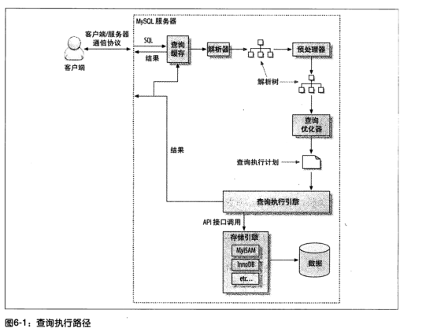

##积硅步, 致千里

### 查询周期

查询的生命周期大致可以按照顺序来看：从客户端，到服务器，然后在服务器上进行解析，生成执行计划，执行，并返回结果给客户端。

### 慢查询

1. 是否向数据库请求了不需要的数据

   * 查询不需要的记录。

     一个常见的错误时常常会误以为MySQL会返回需要的数据，实际上MySQL却是先返回全部结果集再进行计算。

   * 多表关联时返回全部列

   * 总是取出全部列。（select  * ）

   * 重复查询相同的数据。

     例如，在用户评论的地方需要查询用户头像的URL，那么用户多次评论的时候，可能就会反复查询这个数据。比较好的方案是，当初次查询的时候将这个数据缓存起来，需要的时候从缓存中取出。

2. 是否扫描额外的记录

   * 对于MySQL，最简单的衡量查询开销的三个指标 : 响应时间，扫描的函数，返回的行数。
   * 响应时间 ： 服务时间加上排队时间。
   * 扫描的行数和返回的行数
   * 扫描的行数和访问的类型（explain type）
   * MySQL能够使用如下三种方式应用where条件。从好到坏依次为
     1. 在索引中使用where条件来过滤不匹配的记录。这是在存储引擎成完成的。
     2. 使用索引覆盖扫描（在extra列中出现了using index）来返回记录，直接从索引中过滤不需要的记录并返回命中的结果。这是在MySQL服务器成完成的，但无须再回表查询记录。
     3. 从数据表中返回数据，然后过了不满足条件的记录（在 extra 列中出现 using where ）。这在MySQL服务器层完成，MySQL需要先从数据库读出记录然后过滤。

### 重构查询的方式

1. 一个复杂的查询还是多个简单查询

2. 切分查询

   例子，定期地清除大量数据时，如果用一个大的语句一次性完成的话，则可能需啊哟一次锁住很多数据、占满整个事务日志、耗尽系统资源、阻塞很多小的但重要的查询，同时还可以减少MySQL复制的延迟。

3. 分解关联查询优势

   1. - 让缓存的效率更高。许多应用程序可以方便地缓存单表查询对应的结果对象。
      - 将查询分解后，执行单个查询可以减少锁的竞争。
      - 在应用层做关联，可以更容易对数据库进行拆分，更容易做到高性能和可扩展。
      - 可以减少冗余记录的查询。这样的重构还可以减少网络和内存的消耗。

### 查询执行的基础

1. 当向MySQL发送一个请求的时候，MySQL做的事情

2. MySQL 客户端 / 服务器通信协议

   * MySQL客户端和服务器之间的通信协议是 “半双工”的，意味着在任何一个时刻，要么是由服务器向客户端发送数据，要么是由客户端向服务器发送数据，这两个动作不能同时发生。
   * 客户端用一个单独的数据包将查询传给服务器。 `max_allowed_packet` 这个参数配置。

3. 查询状态

   * 对于一个MySQL连接，任何时刻都有一个状态，`show full processlist`

   * sleep  线程正在等待客户端发送新的请求。

   * query 线程正在执行查询或者正在将结果发送给客户端。

   * locked  

     在MySQL服务层，该线程正在等待表锁。在存储引擎级别实现的锁，例如InnoDB的行锁，并不会体现在线程状态中。

   * analyzing and statistics

     线程正在收集存储引擎的统计信息，并生成查询执行计划。

   * copying  to  tmp  table 

     线程正在执行查询，并且将其结果都复制到一个临时表中，这种状态一般要么是在做 `group by` 操作。要么是文件排序操作，或者是 `union` 操作。

   * sorting result 线程正在对结果集进行排序。

   * sending data

     这表示多种情况：线程可能在多个状态之间传送数据，或者在生产结果集，或者在向客户端返回数据。

4. 查询缓存

5. 查询优化处理

   * 语法解析器和预处理

   * 查询优化器

     