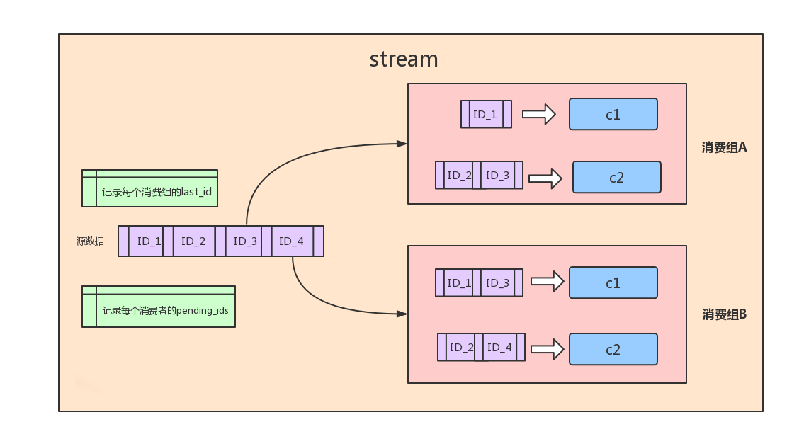

# Stream

## 前言

1. Redis 5.0 版本加入的一个数据结构，php扩展版本是在 4.2 才支持的。
2. stream 是一个日志形式的存储结构，可以往里追加数据，每条数据都会生成一个时间戳ID
3. stream 的特性使其适合做消息队列和时间序列存储。

## 消息ID

消息 ID 的形式是`timestampInMillis-sequence`，例如`1527846880572-5`，它表示当前的消息在毫米时间戳`1527846880572`时产生，并且是该毫秒内产生的第 5 条消息。消息 ID 可以由服务器自动生成，也可以由客户端自己指定，但是形式必须是`整数-整数`，而且必须是后面加入的消息的 ID 要大于前面的消息 ID。

## 场景



1. 源数据用来存放stream的生产出来的数据，数据是按照有seq_id序排列的。 redis会记录stream里每个消费组最后消费的last_id及还没有返回ack确认的id数据。每个消费组都有一个last_id, 也就是说 每个消费组都可以消费同一条数据，每个消费组里可以有多个消费者，多个消费组的关系是相互竞争的。
2.  比如同一条数据，a系统会用，b系统也会用到，那么这时候要用消费组了。 a系统如果只有一个消费者会造成吞吐不够的情况，redis stream consumer group可以在同一个消费组里有多个消费者，consumer消费者多了，吞吐自己就上来了。 redis stream是可以保证这些操作原子性的。
3. stream又维护了一个pending_ids的数据，他的作用是维护消费者的未确认的id，比如消费者get了数据，但是返回给你的时候网络异常了，crash了，又比如消费者收到了，但是crash掉了？ redis stream维护了这些没有xack的id. 我们可以xpending来遍历这些数据，xpending是有时间信息的，我们可以在代码层过滤一个小时之前还未xack的id。

## 向 Stream 添加元素

```html
127.0.0.1:6379> xadd test * name mcy
"1551019218747-0"
```

### 解析：

1. mystream 是 stream的key

2. `*`  所在位置的参数的含义是元素ID，`* ` 表示由系统自动生成一个元素ID

3. 添加的元素包含1个键值对，name mcy

4. 返回值是新增元素的ID，由时间戳和递增数字构成

## 获取 Stream 中的数量

``` html
127.0.0.1:6379> xlen test
(integer) 1
```

## 范围查找

1. 可以使用 `-` 代表最小ID， `+` 代表最大ID

   ```html
   127.0.0.1:6379> xrange test 0 +
   1) 1) "1551019218747-0"
      2) 1) "name"
         2) "mcy"
   2) 1) "1551019520386-0"
      2) 1) "name"
         2) "mcy"
   ```

2. 需要指定起止ID，相当于给一个时间范围

   ```html
   127.0.0.1:6379> xrange test 1551019218747-1 +
   1) 1) "1551019520386-0"
      2) 1) "name"
         2) "mcy"
   ```

3. 当返回元素太多时，可以限定返回结果数量，就像数据库查询时的分页，通过 `COUNT` 参数指定：

   ```html
   127.0.0.1:6379> xrange test - + count 1
   1) 1) "1551019218747-0"
      2) 1) "name"
         2) "mcy"
   ```

4. 还可以反向查询，使用 `XREVRANGE` 命令即可，用法与 `XRANGE` 相同。

## 独立消费

使用 `xread` 时，完全忽略消费组 (Consumer Group) 的存在，就好比 Stream 就是一个普通的列表 (list)。

1. 命令格式

   ```redis
   xread [count count][block milliseconds] streams key [key ...] ID [ID ...]
   ```

2. 非阻塞形式

   ```redis
   > xread count 2 streams mystream 0
   1) 1) "mystream"
      2) 1) 1) "1576160076982-0"
            2) 1) "name"
               2) "hello"
         2) 1) "1576160087747-0"
            2) 1) "name"
               2) "mysql"
   ```

3. 阻塞命令形式

   ```redis
   >xread block 0 streams mystream $
   ```
