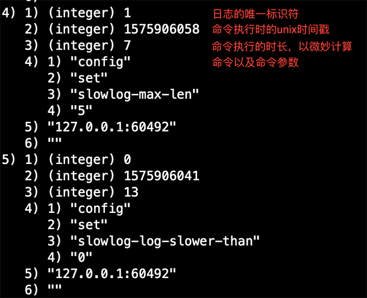

# 优化

## 内存碎片

### 内存碎片率

```html
mem_fragmentation_ratio = used_memory_rss / used_memory
used_memory ：Redis使用其分配器分配的内存大小
used_memory_rss ：操作系统分配给Redis实例的内存大小，表示该进程所占物理内存的大小
两者包括了实际缓存占用的内存和Redis自身运行所占用的内存，used_memory_rss指标还包含了内存碎片的开销，内存碎片是由操作系统低效的分配/回收物理内存导致的。
mem_fragmentation_ratio < 1 表示Redis内存分配超出了物理内存，操作系统正在进行内存交换，内存交换会引起非常明显的响应延迟；
mem_fragmentation_ratio > 1 是合理的；
mem_fragmentation_ratio > 1.5 说明Redis消耗了实际需要物理内存的150%以上，其中50%是内存碎片率。
```

### 内存碎片率高的原因

1. 遇到变长key-value负载：存储的数据长短差异较大，频繁更新，redis的每个k-v对初始化的内存大小是最适合的，当修改的value改变的并且原来内存大小不适用的时候，就需要重新分配内存。重新分配之后，就会有一部分内存redis无法正常回收，一直占用着。
2. maxmemory 限制导致 key 被回收删除，redis写入大量数据，这些数据的 key 和原来的数据很多不一致，数据超过 maxmemory 限制后 redis 会通过 key 的回收策略将部分旧数据淘汰，而被淘汰的数据本身占用的内存却没有被 redis 进程释放，导致 redis 内存的有效数据虽然没有超过最大内存，但是整个进程的内存在一直增长 info 信息中的 evicted_keys 字段显示的是，因为 maxmemory 限制导致key被回收删除的数量。
3. key经常需要回收，会使客户端命令响应延迟时间增加，因为Redis不但要处理客户端过来的命令请求，还要频繁的回收满足条件的key。

### 解决方法

1. 限制内存交换： 如果内存碎片率低于1，Redis实例可能会把部分数据交换到硬盘上，应该增加可用物理内存或减少实Redis内存占用，设置maxmemory和回收策略可以避免强制内存交换。
2. 重启Redis服务器：如果内存碎片率超过1.5，重启Redis服务器可以让额外产生的内存碎片失效并重新作为新内存来使用，使操作系统恢复高效的内存管理。额外碎片的产生是由于Redis释放了内存块，但内存分配器并没有返回内存给操作系统。
3. 内存碎片清理：Redis 4.0-RC3 以上版本，使用 jemalloc 作为内存分配器(默认的) 支持内存碎片清理支持在运行期进行自动内存碎片清理设置自动清理 `config set activedefrag yes`，使用 `config rewrite` 将redis内存中新配置刷新到配置文件。
4. 支持通过命令 `memory purge` 进行手动清理(与自动清理区域不同)

### 配置说明:

```redis
# Enabled active defragmentation
# 碎片整理总开关
# activedefrag yes

# Minimum amount of fragmentation waste to start active defrag
# 内存碎片达到多少的时候开启整理
active-defrag-ignore-bytes 100mb

# Minimum percentage of fragmentation to start active defrag
# 碎片率达到百分之多少开启整理
active-defrag-threshold-lower 10

# Maximum percentage of fragmentation at which we use maximum effort
# 碎片率小余多少百分比开启整理
active-defrag-threshold-upper 100

# Minimal effort for defrag in CPU percentage
active-defrag-cycle-min 25

# Maximal effort for defrag in CPU percentage
active-defrag-cycle-max 75
```

## 开启慢查询日志

### 配置项

1. `slowlog-log-slower-than` 选项指定执行时间超过多少微秒（1 秒等于 1,000,000 微秒）的命令请求会被记录到日志上。举个例子， 如果这个选项的值为 100 ， 那么执行时间超过 100 微秒的命令就会被记录到慢查询日志； 如果这个选项的值为 500 ， 那么执行时间超过 500 微秒的命令就会被记录到慢查询日志。

2. `slowlog-max-len` 选项指定服务器最多保存多少条慢查询日志。

   ```redis
   config get slowlog-log-slower-than
   config get slowlog-max-len
   ```

### 客户端查看慢查询日志

```redis
slowlog get 	#获取慢查询日志
slowlog len 	#获取慢查询日志条数
slowlog reset 	#清空慢查询	
```



