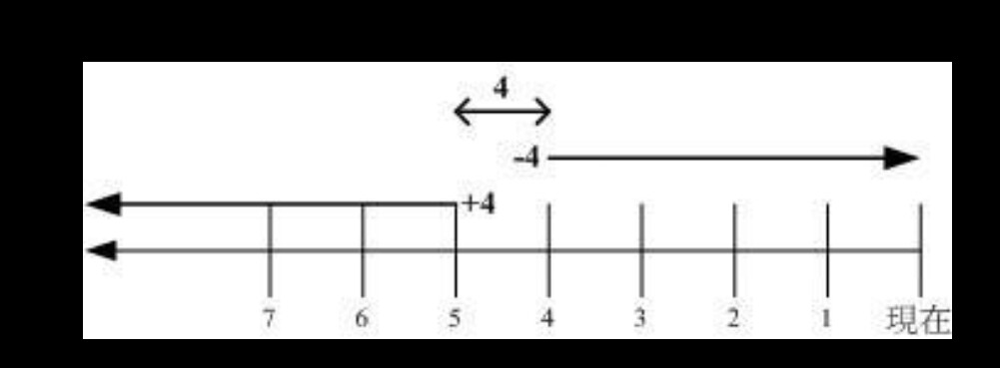

### 记录linux基础命令

1. ls

   ```html
   ls -l --full-time  显示完整的时间格式
   ```

2. which ( 寻找__执行文件__ )

   * 由于 which 是根据使用者所设定的__PATH变量__ 内的目录去搜索可执行文件的, 所以root用户和普通用户使用which可能会出现不同结果

3. whereis( 寻找特定文件)

   * -b 只找二进制格式的文件

   * -m 只找说明文件

   * 只找source来源文件

   * -u 搜索不在上述三个项目当中的其他特殊文件

     __注意__ 由于linux系统会将系统内的所有文件都记录在一个资料库文件里面, 而当使用 `whereis`  或者是 `locate`  时, 都会以此资料库文件的内容为准, 因此, 有时候会发现使用这两个执行文件时, 会找到已经被杀掉的文件, 而且也找不到最新的刚刚建立的文件.

4. find

   ```html
   1. 与时间有关的选项
   	-atime  -ctime  -mtime
   	-mtime n : n为数字, 意义为在n天前的(一天之内)被更改过内容的文件,
   			 -mtime+n 列出在n天之内(含n天本身)被更改过内容的文件名
       -newer file : file为一个存在的文件, 列出比file还要新的文件名
   	例子
   	  	find /etc -newer /etc/passwd   查找/etc文件夹下比passwd还新的文件名
   	  	find / -mtime 3                查找三天前的24小时内变动过内容的文件列出
   	  	find / -mtime 0                将过去系统上面24小时内有更动过内容的文件列出来
   	  	find /var -mtime -4            查找4天内被更动过的文件名
   2. 与使用者或群组名称有关的参数 
   	-user 查找属于某个用户的文件
   	-nouser 查找无主的文件
   	例子
   		find /home -user machunyu       查找/home 底下属于machunyu的文件
   		find /-nouser 				    透过这个指令, 可以轻易的找到那些不太正常的文件
   3. 与文件权限以及名称有关的参数
   	-name filename  					查找文件名称为filename的文件
   	-size[+-] SIZE 						查找比SIZE还大的文件
   	-type Type                          类型有 f为正规文件, b c 装置文件, d 为目录, l 连接档等
   	-perm [+-] mode    					查找权限
   	例子
   		find -name test.php             搜索文件名称为test.php
   		find /root -size +50k  			搜索比50k还要大的文件
   	
   ```

   __注意__ 

   ​

   ​

   ​

   ​


